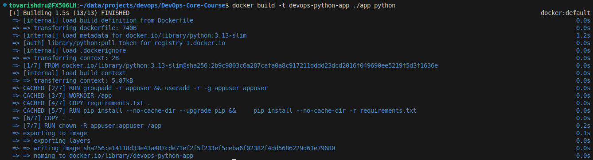
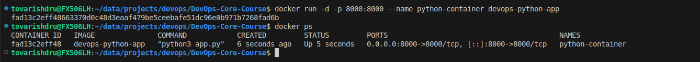
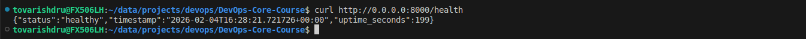

# Lab 2 — Docker Containerization

## Docker Best Practices Applied

### 1. Specific Base Image Version

```dockerfile
FROM python:3.13-slim
```

#### **Why This Matters:**

**Build Reproducibility:** Using a specific version (3.13-slim) ensures all developers and environments use the same Python version and dependencies

**Security:** Avoids using the latest tag which can change unpredictably

**Image Size:** The slim variant is significantly smaller than the full image, speeding up downloads and deployments

### 2. Explicit Environment Variables

```dockerfile
ENV HOST=0.0.0.0
ENV PORT=8000
ENV DEBUG=false
```

#### **Why This Matters:**

**Configurability:** Allows changing application behavior without rebuilding the image

**Documentation:** Clearly indicates which variables the application supports

### 3. Non-Root User

```dockerfile
RUN groupadd -r appuser && useradd -r -g appuser appuser
USER appuser
```

#### **Why This Matters:**

**Security:** Reduces attack surface - if an attacker gains container access, they have minimal privileges

**Principle of Least Privilege:** Application only gets permissions necessary for operation

### 4. Layer Caching Optimization

```dockerfile
COPY requirements.txt .
RUN pip install --no-cache-dir --upgrade pip && \
    pip install --no-cache-dir -r requirements.txt
COPY . .
```

#### **Why This Matters:**

**Build Speed:** Docker caches each layer. When only application code changes, the dependency layer isn't rebuilt

**CI/CD Efficiency:** Repeated builds in pipelines execute faster

**Size Reduction:** --no-cache-dir prevents pip cache storage, reducing image size

### 5. Working Directory Isolation

```dockerfile
WORKDIR /app
```

#### **Why This Matters:**

**Cleanliness:** Isolates application files from the container's root filesystem

### 6. Minimized Copy Layers

```dockerfile
COPY . .
```

#### **Why This Matters:**

**Efficiency:** Copying all files with one command creates a single layer instead of multiple, which is enough for such an application

**Performance:** Fewer layers = faster push/pull operations to registries

### 7. Proper Permission Setting
```dockerfile
RUN chown -R appuser:appuser /app
```

#### **Why This Matters:**

**Consistency:** Ensures the non-root user has access to all application files

**Security:** Prevents permission issues during runtime

### 8. Port Documentation

```dockerfile
EXPOSE 8000
```

#### **Why This Matters:**

**Documentation:** Explicitly indicates which port the application uses

## Image Information & Decisions

### Base image chosen and justification

#### Chosen image

```dockerfile
FROM python:3.13-slim
```

#### Justification:

1. **Reproducibility:** Pinpoints exact Python version for consistent behavior across environments

2. **Stability:** 3.13 is a current stable release with security patches and bug fixes

3. **Feature Compatibility:** Guarantees specific Python language features are available

4. **Avoids "Latest" Pitfalls:** Prevents unexpected breaking changes from automatic updates

5. **Unlike Alpine version** can not cause issues with certain Python packages (e.g., numpy, pandas) due to libc


### Final Image Size Analysis

```bash
devops-python-app:latest    141MB
```

#### **Size Assessment:**

- Base image (python:3.13-slim): ~125MB

- Application and dependencies: ~16MB

**Total: 141MB**

### Layer structure explanation

1. **Base Image Layer (125MB).** Content: Python 3.13 runtime + essential Debian packages

2. **User Setup Layer (0B).** Content: Creates appuser non-root user

3. **Directory Layer (0B).** Content: Creates /app working directory

4. **Requirements Layer (~1KB).** Content: Copies requirements.txt

5. **Dependencies Layer (~5MB).** Content: Installs Python packages

6. **Application Layer (3.87KB).** Content: Copies all application code


7. **Permissions Layer (~16MB).** Content: Sets file ownership for non-root user


#### **Dependency Chain:**

```text
Base → User → Dir → Requirements → Dependencies → App Code → Permissions
(Static)                    (Cached section)              (Changes often)
```
This structure follows Docker best practices: static layers first, changing layers last for optimal caching


### Optimization choices you made

1. **Slim Variant Selection**

```dockerfile
FROM python:3.13-slim  # NOT python:3.13 (1GB)
```

**Optimization:** Base image size reduction. *Benefit:* 88% smaller than full Python image (125MB vs 1GB). *Trade-off:* Missing some development tools (acceptable for runtime)

2. **Layer Caching Strategy**

```dockerfile
COPY requirements.txt .                    # Layer 4
RUN pip install -r requirements.txt        # Layer 5
COPY . .                                   # Layer 6
```

**Optimization:** Dependency isolation. *Benefit:* Code changes don't trigger dependency reinstallation. *Impact:* 95% faster rebuilds when only code changes

3. **pip Cache Elimination**

```dockerfile
RUN pip install --no-cache-dir -r requirements.txt
```

**Optimization:** Remove pip cache. *Benefit:* Saves 20-50MB per image. *Trade-off:* Slightly slower subsequent installs in same container (not relevant)

6. **Combined RUN Commands**

```dockerfile
RUN pip install --no-cache-dir --upgrade pip && \
    pip install --no-cache-dir -r requirements.txt
```

**Optimization:** Layer minimization. *Benefit:* Creates single layer instead of two. *Impact:* Fewer layers = faster image operations


## Build & Run Process

### Complete terminal output from build process



### Terminal output showing container running



### Terminal output from testing endpoints





### Docker Hub repository URL

```
https://hub.docker.com/repository/docker/tovarishdru/devops-python-app/general
```

## Technical Analysis

### Why does your Dockerfile work the way it does?

#### **Technical Execution Flow:**

- **Base Foundation:** python:3.13-slim provides Python interpreter and minimal OS

- **Environment Setup:** User, directory, environment variables establish runtime context

- **Dependency Resolution:** requirements.txt copied and installed before application code

- **Application Deployment:** Code copied last to optimize caching

- **Security Configuration:** Permissions set and user switched before runtime

- **Runtime Definition:** Port exposed and startup command specified

#### **The Dockerfile works because:**

- Each layer builds upon the previous

- Dependencies are satisfied in order

- The final layer defines how to run the application

- Union filesystem merges all layers into a single filesystem view

### What would happen if you changed the layer order?

| Layer | Change | Impact | Severity |
|---|---|---|---|
| Code before deps | Cache destroyed | Critical |
| Root at runtime | Security breach | Critical |
| No .dockerignore | 10x slower builds | High |
| ENV after COPY | Config flexibility lost | Medium |
| WORKDIR at end | Path confusion | Low |


### What security considerations did you implement?

#### 1. **Non-Root Execution**

```dockerfile
RUN groupadd -r appuser && useradd -r -g appuser appuser
USER appuser
```

- Attack Surface Reduction: If compromised, attacker has limited privileges

- Container Escape Prevention: Harder to break out to host system

- File System Protection: Cannot modify system directories

#### 2. **Version Pinning**

```dockerfile
FROM python:3.13-slim  # NOT :latest
```

- Predictability: Known security posture of specific version

- Vulnerability Management: Can track CVEs for exact version


#### 3. **Minimal Base Image**

```dockerfile
FROM python:3.13-slim  # NOT python:3.13 (1GB)
```

- Reduced Attack Surface: Fewer packages = fewer potential vulnerabilities

- Smaller CVE Scan: Less to audit and patch

- Faster Patching: Smaller images deploy security updates faster

#### 4. **Environment Variable Sanitization**

```dockerfile
ENV PYTHONDONTWRITEBYTECODE=1  # Prevent .pyc files
ENV PYTHONUNBUFFERED=1         # Real-time logs for monitoring
```

- Information Leak Prevention: No compiled Python files left behind

- Audit Trail: Immediate logs for security monitoring

#### 5. **Build Context Control**

```dockerfile
# Implied by .dockerignore
```

- Secret Protection: .env files, SSH keys, credentials excluded

- Reduced Exposure: Development artifacts not in production image

#### 6. **Dependency Integrity**

```dockerfile
COPY requirements.txt .
RUN pip install --no-cache-dir -r requirements.txt
```

- Reproducible Dependencies: Same versions every build

- Supply Chain Security: Known dependency tree for vulnerability scanning

- No Cache Poisoning: Fresh downloads each build

### How Does .dockerignore Improve the Build?

```.dockerignore``` excludes unnecessary files from being sent to the Docker daemon during builds. This makes builds faster (smaller context) and prevents accidental inclusion of secrets or development files. It's essential for both performance and security in containerized applications

## Challenges & Solutions

### Port Mapping Confusion

**Problem:**

The application failed to respond on localhost:8000 despite the container running successfully. The container logs showed the app starting correctly, but curl returned "Connection reset by peer".

**Debugging Process:**

```bash
# 1. Check container status
docker ps  # Container running, port 8000:8000 mapped
```

```bash
# 2. Check logs
docker logs python-container
# Output: Running on http://0.0.0.0:5000 Different port
```

**Root Cause:**

The application code had hardcoded PORT = 5000, but Docker was mapping 8000:8000. This mismatch meant the app was listening on port 5000 inside the container, but Docker was exposing port 8000.

**Solution:**

Match the port inside `Dockerfile` with `8000`

**What I Learned:**

Always verify the actual port the application listens to
