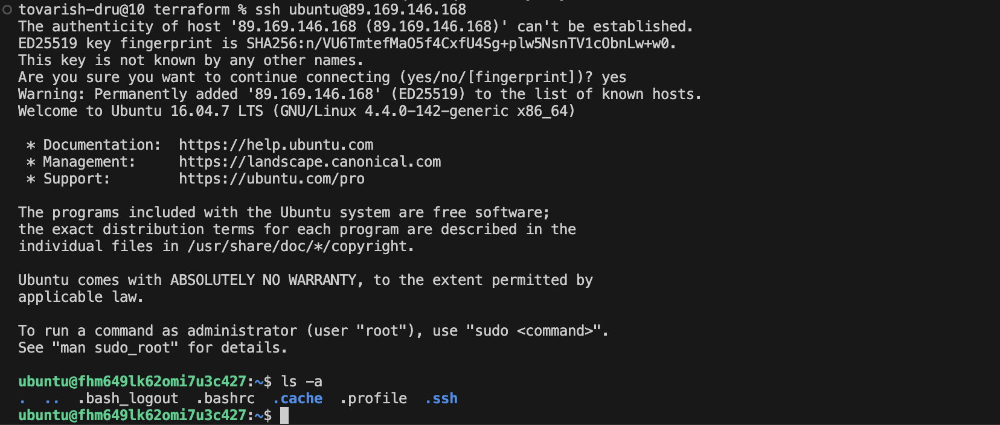
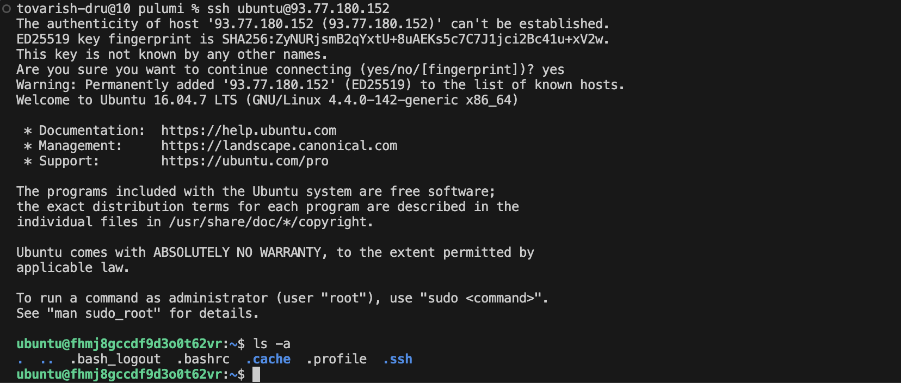

# LAB04 Report

## Cloud Provider & Infrastructure

### Cloud provider chosen and rationale

I chose **YandexCloud** because I had an experience with working with it, and, what is important, it requires no VPN to access

### Instance type/size and why

**Cloud/instance platform:** Yandex Cloud Compute Cloud, platform_id = "standard-v2".

**vCPU/RAM:** cores = 2, core_fraction = 20%, memory = 1 GB.

**Disk:** boot disk size = 10 GB.

**Why:** Minimal configuration, which lies in Yandex Cloud free tier and allows to cmplete the lab

### Region/zone selected

**Zone:** `ru-central1-a`. It is a standard zone in the ru-central region

### Total cost

**Cost estimation:** $0 free-tier minimalistic setup was used, so it is free

### Resources created

There were created the following resources:

- VPC Network: yandex_vpc_network.lab_network

  - name: lab-network

- Subnet: yandex_vpc_subnet.lab_subnet

  - name: lab-subnet
  - zone: ru-central1-a
  - CIDR: 10.10.0.0/24

- Security Group: yandex_vpc_security_group.lab_sg

  - name: lab-sg
  - ingress:
    - TCP 22 (SSH) только с var.my_ip
    - TCP 80 (HTTP) с 0.0.0.0/0
    - TCP 5000 (app) с 0.0.0.0/0
  - egress:
    - ANY на 0.0.0.0/0

- Compute Instance (VM): yandex_compute_instance.lab_vm

  - name: lab-vm
  - platform: standard-v2
  - resources: 2 cores, 1 GB RAM, core_fraction=20
  - boot disk: 10 GB, image var.image_id
  - network interface: subnet lab_subnet, NAT enabled (public IP), security group lab_sg
  - metadata: SSH key ssh-keys = ubuntu:<public_key>

- Public IP (NAT IP):

  - created automatically via nat = true в network_interface VM

## Terraform Implementation

### Terraform version used

`Terraform v1.5.7`

### Project structure explanation

The Terraform project is split into multiple files for readability and maintainability:

- main.tf — the main infrastructure definition:
  - Yandex Cloud provider setup (required_providers, provider "yandex")
  - resource definitions: VPC network, subnet, security group, compute instance

- variables.tf — input variables to avoid hardcoding values:
  - zone (default: ru-central1-a)
  - folder_id, token, image_id, my_ip, public_key_path

- outputs.tf — outputs printed after terraform apply:
  - public_ip (the VM public IP used for SSH access)

This structure allows changing environment-specific values via variables without modifying main.tf, and makes it easy to retrieve key information via outputs

### Key configuration decisions

Key decisions made in the configuration:

1. Using variables for sensitive and environment-specific values

    - token, folder_id, image_id, my_ip, public_key_path are defined as variables to:

      - avoid storing secrets directly in code

      - make the configuration reusable across different folders/zones/projects

2. Choosing a small/free-tier VM configuration

    - platform_id = "standard-v2"

    - cores = 2, core_fraction = 20, memory = 1

    - boot disk size: 10 GB This keeps resource usage and cost minimal
  while still being sufficient for lab tasks

3. Creating a dedicated network and subnet

    - yandex_vpc_network + yandex_vpc_subnet with CIDR 10.10.0.0/24 This is a standard approach: the VM is deployed into a controlled and reproducible network environment

4. Enabling a public IP via NAT

    - nat = true in the VM network_interface This provides a public IP for:

      - SSH access from the internet

      - future HTTP/application access (ports 80 and 5000)

5. Security group rules with restricted SSH

    - Port 22 is allowed only from var.my_ip (safer than 0.0.0.0/0)

    - Ports 80 and 5000 are open to 0.0.0.0/0 for web/app access

    - egress ANY is allowed to enable outbound traffic (package updates, downloading dependencies, etc.)

6. SSH key injection via instance metadata

    - metadata.ssh-keys = "ubuntu:${file(var.public_key_path)}" This is the standard Yandex Cloud method to inject an SSH public key at VM creation time, enabling login as ubuntu@<public_ip>

### Challenges encountered

Challenges:

1. SSH access details (key path and username)

    - The correct username (ubuntu) must be used

### Terminal output

```bash
tovarish-dru@10 terraform % terraform init
Terraform initialized in an empty directory!

The directory has no Terraform configuration files. You may begin working
with Terraform immediately by creating Terraform configuration files.
tovarish-dru@10 terraform % clear
tovarish-dru@10 terraform % terraform init

Initializing the backend...

Initializing provider plugins...
- Finding latest version of yandex-cloud/yandex...
- Installing yandex-cloud/yandex v0.187.0...
- Installed yandex-cloud/yandex v0.187.0 (unauthenticated)

Terraform has created a lock file .terraform.lock.hcl to record the provider
selections it made above. Include this file in your version control repository
so that Terraform can guarantee to make the same selections by default when
you run "terraform init" in the future.

╷
│ Warning: Incomplete lock file information for providers
│ 
│ Due to your customized provider installation methods, Terraform was forced to calculate lock file checksums locally for the following providers:
│   - yandex-cloud/yandex
│ 
│ The current .terraform.lock.hcl file only includes checksums for darwin_arm64, so Terraform running on another platform will fail to install these providers.
│ 
│ To calculate additional checksums for another platform, run:
│   terraform providers lock -platform=linux_amd64
│ (where linux_amd64 is the platform to generate)
╵

Terraform has been successfully initialized!

You may now begin working with Terraform. Try running "terraform plan" to see
any changes that are required for your infrastructure. All Terraform commands
should now work.

If you ever set or change modules or backend configuration for Terraform,
rerun this command to reinitialize your working directory. If you forget, other
commands will detect it and remind you to do so if necessary.
```


```bash
tovarish-dru@10 terraform % terraform plan

Terraform used the selected providers to generate the following execution plan. Resource actions are indicated with the following symbols:
  + create

Terraform will perform the following actions:

  # yandex_compute_instance.lab_vm will be created
  + resource "yandex_compute_instance" "lab_vm" {
      + created_at                = (known after apply)
      + folder_id                 = (known after apply)
      + fqdn                      = (known after apply)
      + gpu_cluster_id            = (known after apply)
      + hardware_generation       = (known after apply)
      + hostname                  = (known after apply)
      + id                        = (known after apply)
      + maintenance_grace_period  = (known after apply)
      + maintenance_policy        = (known after apply)
      + metadata                  = {
          + "ssh-keys" = <<-EOT
                ubuntu:ssh-ed25519 AAAAC3NzaC1lZDI1NTE5AAAAIJ6zDhIQGtvYedVxFlB7+VDDDxOMZWXzvcN2OE0EV/+U dryshatu@yandex.ru
            EOT
        }
      + name                      = "lab-vm"
      + network_acceleration_type = "standard"
      + platform_id               = "standard-v2"
      + status                    = (known after apply)
      + zone                      = (known after apply)

      + boot_disk {
          + auto_delete = true
          + device_name = (known after apply)
          + disk_id     = (known after apply)
          + mode        = (known after apply)

          + initialize_params {
              + block_size  = (known after apply)
              + description = (known after apply)
              + image_id    = "fd800c7s2p483i648ifv"
              + name        = (known after apply)
              + size        = 10
              + snapshot_id = (known after apply)
              + type        = "network-hdd"
            }
        }

      + network_interface {
          + index              = (known after apply)
          + ip_address         = (known after apply)
          + ipv4               = true
          + ipv6               = (known after apply)
          + ipv6_address       = (known after apply)
          + mac_address        = (known after apply)
          + nat                = true
          + nat_ip_address     = (known after apply)
          + nat_ip_version     = (known after apply)
          + security_group_ids = (known after apply)
          + subnet_id          = (known after apply)
        }

      + resources {
          + core_fraction = 20
          + cores         = 2
          + memory        = 1
        }
    }

  # yandex_vpc_network.lab_network will be created
  + resource "yandex_vpc_network" "lab_network" {
      + created_at                = (known after apply)
      + default_security_group_id = (known after apply)
      + folder_id                 = (known after apply)
      + id                        = (known after apply)
      + labels                    = (known after apply)
      + name                      = "lab-network"
      + subnet_ids                = (known after apply)
    }

  # yandex_vpc_security_group.lab_sg will be created
  + resource "yandex_vpc_security_group" "lab_sg" {
      + created_at = (known after apply)
      + folder_id  = (known after apply)
      + id         = (known after apply)
      + labels     = (known after apply)
      + name       = "lab-sg"
      + network_id = (known after apply)
      + status     = (known after apply)

      + egress {
          + from_port      = -1
          + id             = (known after apply)
          + labels         = (known after apply)
          + port           = -1
          + protocol       = "ANY"
          + to_port        = -1
          + v4_cidr_blocks = [
              + "0.0.0.0/0",
            ]
          + v6_cidr_blocks = []
        }

      + ingress {
          + from_port      = -1
          + id             = (known after apply)
          + labels         = (known after apply)
          + port           = 22
          + protocol       = "TCP"
          + to_port        = -1
          + v4_cidr_blocks = [
              + "93.158.188.106/32",
            ]
          + v6_cidr_blocks = []
        }
      + ingress {
          + from_port      = -1
          + id             = (known after apply)
          + labels         = (known after apply)
          + port           = 5000
          + protocol       = "TCP"
          + to_port        = -1
          + v4_cidr_blocks = [
              + "0.0.0.0/0",
            ]
          + v6_cidr_blocks = []
        }
      + ingress {
          + from_port      = -1
          + id             = (known after apply)
          + labels         = (known after apply)
          + port           = 80
          + protocol       = "TCP"
          + to_port        = -1
          + v4_cidr_blocks = [
              + "0.0.0.0/0",
            ]
          + v6_cidr_blocks = []
        }
    }

  # yandex_vpc_subnet.lab_subnet will be created
  + resource "yandex_vpc_subnet" "lab_subnet" {
      + created_at     = (known after apply)
      + folder_id      = (known after apply)
      + id             = (known after apply)
      + labels         = (known after apply)
      + name           = "lab-subnet"
      + network_id     = (known after apply)
      + v4_cidr_blocks = [
          + "10.10.0.0/24",
        ]
      + v6_cidr_blocks = (known after apply)
      + zone           = "ru-central1-a"
    }

Plan: 4 to add, 0 to change, 0 to destroy.

Changes to Outputs:
  + public_ip = (known after apply)

```


```bash
tovarish-dru@10 terraform % terraform apply

Terraform used the selected providers to generate the following execution plan. Resource actions are indicated with the following symbols:
  + create

Terraform will perform the following actions:

  # yandex_compute_instance.lab_vm will be created
  + resource "yandex_compute_instance" "lab_vm" {
      + created_at                = (known after apply)
      + folder_id                 = (known after apply)
      + fqdn                      = (known after apply)
      + gpu_cluster_id            = (known after apply)
      + hardware_generation       = (known after apply)
      + hostname                  = (known after apply)
      + id                        = (known after apply)
      + maintenance_grace_period  = (known after apply)
      + maintenance_policy        = (known after apply)
      + metadata                  = {
          + "ssh-keys" = <<-EOT
                ubuntu:ssh-ed25519 AAAAC3NzaC1lZDI1NTE5AAAAIJ6zDhIQGtvYedVxFlB7+VDDDxOMZWXzvcN2OE0EV/+U dryshatu@yandex.ru
            EOT
        }
      + name                      = "lab-vm"
      + network_acceleration_type = "standard"
      + platform_id               = "standard-v2"
      + status                    = (known after apply)
      + zone                      = (known after apply)

      + boot_disk {
          + auto_delete = true
          + device_name = (known after apply)
          + disk_id     = (known after apply)
          + mode        = (known after apply)

          + initialize_params {
              + block_size  = (known after apply)
              + description = (known after apply)
              + image_id    = "fd800c7s2p483i648ifv"
              + name        = (known after apply)
              + size        = 10
              + snapshot_id = (known after apply)
              + type        = "network-hdd"
            }
        }

      + network_interface {
          + index              = (known after apply)
          + ip_address         = (known after apply)
          + ipv4               = true
          + ipv6               = (known after apply)
          + ipv6_address       = (known after apply)
          + mac_address        = (known after apply)
          + nat                = true
          + nat_ip_address     = (known after apply)
          + nat_ip_version     = (known after apply)
          + security_group_ids = (known after apply)
          + subnet_id          = (known after apply)
        }

      + resources {
          + core_fraction = 20
          + cores         = 2
          + memory        = 1
        }
    }

  # yandex_vpc_network.lab_network will be created
  + resource "yandex_vpc_network" "lab_network" {
      + created_at                = (known after apply)
      + default_security_group_id = (known after apply)
      + folder_id                 = (known after apply)
      + id                        = (known after apply)
      + labels                    = (known after apply)
      + name                      = "lab-network"
      + subnet_ids                = (known after apply)
    }

  # yandex_vpc_security_group.lab_sg will be created
  + resource "yandex_vpc_security_group" "lab_sg" {
      + created_at = (known after apply)
      + folder_id  = (known after apply)
      + id         = (known after apply)
      + labels     = (known after apply)
      + name       = "lab-sg"
      + network_id = (known after apply)
      + status     = (known after apply)

      + egress {
          + from_port      = -1
          + id             = (known after apply)
          + labels         = (known after apply)
          + port           = -1
          + protocol       = "ANY"
          + to_port        = -1
          + v4_cidr_blocks = [
              + "0.0.0.0/0",
            ]
          + v6_cidr_blocks = []
        }

      + ingress {
          + from_port      = -1
          + id             = (known after apply)
          + labels         = (known after apply)
          + port           = 22
          + protocol       = "TCP"
          + to_port        = -1
          + v4_cidr_blocks = [
              + "93.158.188.106/32",
            ]
          + v6_cidr_blocks = []
        }
      + ingress {
          + from_port      = -1
          + id             = (known after apply)
          + labels         = (known after apply)
          + port           = 5000
          + protocol       = "TCP"
          + to_port        = -1
          + v4_cidr_blocks = [
              + "0.0.0.0/0",
            ]
          + v6_cidr_blocks = []
        }
      + ingress {
          + from_port      = -1
          + id             = (known after apply)
          + labels         = (known after apply)
          + port           = 80
          + protocol       = "TCP"
          + to_port        = -1
          + v4_cidr_blocks = [
              + "0.0.0.0/0",
            ]
          + v6_cidr_blocks = []
        }
    }

  # yandex_vpc_subnet.lab_subnet will be created
  + resource "yandex_vpc_subnet" "lab_subnet" {
      + created_at     = (known after apply)
      + folder_id      = (known after apply)
      + id             = (known after apply)
      + labels         = (known after apply)
      + name           = "lab-subnet"
      + network_id     = (known after apply)
      + v4_cidr_blocks = [
          + "10.10.0.0/24",
        ]
      + v6_cidr_blocks = (known after apply)
      + zone           = "ru-central1-a"
    }

Plan: 4 to add, 0 to change, 0 to destroy.

Changes to Outputs:
  + public_ip = (known after apply)

Do you want to perform these actions?
  Terraform will perform the actions described above.
  Only 'yes' will be accepted to approve.

  Enter a value: yes

yandex_vpc_network.lab_network: Creating...
yandex_vpc_network.lab_network: Creation complete after 3s [id=enpur7u4kcoan0frunog]
yandex_vpc_subnet.lab_subnet: Creating...
yandex_vpc_security_group.lab_sg: Creating...
yandex_vpc_subnet.lab_subnet: Creation complete after 0s [id=e9bsd88n95prb8las7bo]
yandex_vpc_security_group.lab_sg: Creation complete after 2s [id=enprhiacin2gasotkvu5]
yandex_compute_instance.lab_vm: Creating...
yandex_compute_instance.lab_vm: Still creating... [10s elapsed]
yandex_compute_instance.lab_vm: Still creating... [20s elapsed]
yandex_compute_instance.lab_vm: Still creating... [30s elapsed]
yandex_compute_instance.lab_vm: Still creating... [40s elapsed]
yandex_compute_instance.lab_vm: Still creating... [50s elapsed]
yandex_compute_instance.lab_vm: Still creating... [1m0s elapsed]
yandex_compute_instance.lab_vm: Still creating... [1m10s elapsed]
yandex_compute_instance.lab_vm: Still creating... [1m20s elapsed]
yandex_compute_instance.lab_vm: Still creating... [1m30s elapsed]
yandex_compute_instance.lab_vm: Still creating... [1m40s elapsed]
yandex_compute_instance.lab_vm: Still creating... [1m50s elapsed]
yandex_compute_instance.lab_vm: Creation complete after 1m58s [id=fhm1difrt7oa1lp9ndr8]

Apply complete! Resources: 4 added, 0 changed, 0 destroyed.

Outputs:

public_ip = "89.169.146.168"
```



```bash
tovarish-dru@10 terraform % terraform destroy        
yandex_vpc_network.lab_network: Refreshing state... [id=enplqbqm52csri4nltd6]
yandex_vpc_subnet.lab_subnet: Refreshing state... [id=e9brv56kutfb5ajrlgcp]
yandex_vpc_security_group.lab_sg: Refreshing state... [id=enpbhmjtt792kbrnfnf2]
yandex_compute_instance.lab_vm: Refreshing state... [id=fhme0v4h94m5r85r2icd]

Terraform used the selected providers to generate the following execution plan. Resource actions are indicated with the following symbols:
  - destroy

Terraform will perform the following actions:

  # yandex_compute_instance.lab_vm will be destroyed
  - resource "yandex_compute_instance" "lab_vm" {
      - created_at                = "2026-02-18T17:20:14Z" -> null
      - folder_id                 = "b1gr028eqbrjj5cnnf77" -> null
      - fqdn                      = "fhme0v4h94m5r85r2icd.auto.internal" -> null
      - hardware_generation       = [
          - {
              - generation2_features = []
              - legacy_features      = [
                  - {
                      - pci_topology = "PCI_TOPOLOGY_V1"
                    },
                ]
            },
        ] -> null
      - id                        = "fhme0v4h94m5r85r2icd" -> null
      - labels                    = {} -> null
      - metadata                  = {
          - "ssh-keys" = <<-EOT
                ubuntu:ssh-ed25519 AAAAC3NzaC1lZDI1NTE5AAAAIJ6zDhIQGtvYedVxFlB7+VDDDxOMZWXzvcN2OE0EV/+U dryshatu@yandex.ru
            EOT
        } -> null
      - name                      = "lab-vm" -> null
      - network_acceleration_type = "standard" -> null
      - platform_id               = "standard-v2" -> null
      - status                    = "running" -> null
      - zone                      = "ru-central1-a" -> null

      - boot_disk {
          - auto_delete = true -> null
          - device_name = "fhm2g65qmeej0vail02m" -> null
          - disk_id     = "fhm2g65qmeej0vail02m" -> null
          - mode        = "READ_WRITE" -> null

          - initialize_params {
              - block_size = 4096 -> null
              - image_id   = "fd800c7s2p483i648ifv" -> null
              - size       = 10 -> null
              - type       = "network-hdd" -> null
            }
        }

      - metadata_options {
          - aws_v1_http_endpoint = 1 -> null
          - aws_v1_http_token    = 2 -> null
          - gce_http_endpoint    = 1 -> null
          - gce_http_token       = 1 -> null
        }

      - network_interface {
          - index              = 0 -> null
          - ip_address         = "10.10.0.11" -> null
          - ipv4               = true -> null
          - ipv6               = false -> null
          - mac_address        = "d0:0d:e0:7c:91:49" -> null
          - nat                = true -> null
          - nat_ip_address     = "62.84.119.62" -> null
          - nat_ip_version     = "IPV4" -> null
          - security_group_ids = [
              - "enpbhmjtt792kbrnfnf2",
            ] -> null
          - subnet_id          = "e9brv56kutfb5ajrlgcp" -> null
        }

      - placement_policy {
          - host_affinity_rules       = [] -> null
          - placement_group_partition = 0 -> null
        }

      - resources {
          - core_fraction = 20 -> null
          - cores         = 2 -> null
          - gpus          = 0 -> null
          - memory        = 1 -> null
        }

      - scheduling_policy {
          - preemptible = false -> null
        }
    }

  # yandex_vpc_network.lab_network will be destroyed
  - resource "yandex_vpc_network" "lab_network" {
      - created_at                = "2026-02-18T17:20:07Z" -> null
      - default_security_group_id = "enpeoldons0ui7dmvu3r" -> null
      - folder_id                 = "b1gr028eqbrjj5cnnf77" -> null
      - id                        = "enplqbqm52csri4nltd6" -> null
      - labels                    = {} -> null
      - name                      = "lab-network" -> null
      - subnet_ids                = [
          - "e9brv56kutfb5ajrlgcp",
        ] -> null
    }

  # yandex_vpc_security_group.lab_sg will be destroyed
  - resource "yandex_vpc_security_group" "lab_sg" {
      - created_at = "2026-02-18T17:20:13Z" -> null
      - folder_id  = "b1gr028eqbrjj5cnnf77" -> null
      - id         = "enpbhmjtt792kbrnfnf2" -> null
      - labels     = {} -> null
      - name       = "lab-sg" -> null
      - network_id = "enplqbqm52csri4nltd6" -> null
      - status     = "ACTIVE" -> null

      - egress {
          - from_port      = -1 -> null
          - id             = "enp5l6nn9gqs6qae2jhq" -> null
          - labels         = {} -> null
          - port           = -1 -> null
          - protocol       = "ANY" -> null
          - to_port        = -1 -> null
          - v4_cidr_blocks = [
              - "0.0.0.0/0",
            ] -> null
          - v6_cidr_blocks = [] -> null
        }

      - ingress {
          - from_port      = -1 -> null
          - id             = "enpevccfgrp0k5l18sv8" -> null
          - labels         = {} -> null
          - port           = 22 -> null
          - protocol       = "TCP" -> null
          - to_port        = -1 -> null
          - v4_cidr_blocks = [
              - "93.158.188.106/32",
            ] -> null
          - v6_cidr_blocks = [] -> null
        }
      - ingress {
          - from_port      = -1 -> null
          - id             = "enpq9imifcss6f1b6nuv" -> null
          - labels         = {} -> null
          - port           = 5000 -> null
          - protocol       = "TCP" -> null
          - to_port        = -1 -> null
          - v4_cidr_blocks = [
              - "0.0.0.0/0",
            ] -> null
          - v6_cidr_blocks = [] -> null
        }
      - ingress {
          - from_port      = -1 -> null
          - id             = "enpv0rlan39hkjvi5ced" -> null
          - labels         = {} -> null
          - port           = 80 -> null
          - protocol       = "TCP" -> null
          - to_port        = -1 -> null
          - v4_cidr_blocks = [
              - "0.0.0.0/0",
            ] -> null
          - v6_cidr_blocks = [] -> null
        }
    }

  # yandex_vpc_subnet.lab_subnet will be destroyed
  - resource "yandex_vpc_subnet" "lab_subnet" {
      - created_at     = "2026-02-18T17:20:10Z" -> null
      - folder_id      = "b1gr028eqbrjj5cnnf77" -> null
      - id             = "e9brv56kutfb5ajrlgcp" -> null
      - labels         = {} -> null
      - name           = "lab-subnet" -> null
      - network_id     = "enplqbqm52csri4nltd6" -> null
      - v4_cidr_blocks = [
          - "10.10.0.0/24",
        ] -> null
      - v6_cidr_blocks = [] -> null
      - zone           = "ru-central1-a" -> null
    }

Plan: 0 to add, 0 to change, 4 to destroy.

Changes to Outputs:
  - public_ip = "89.169.146.168" -> null

Do you really want to destroy all resources?
  Terraform will destroy all your managed infrastructure, as shown above.
  There is no undo. Only 'yes' will be accepted to confirm.

  Enter a value: yes

yandex_compute_instance.lab_vm: Destroying... [id=fhme0v4h94m5r85r2icd]
yandex_compute_instance.lab_vm: Still destroying... [id=fhme0v4h94m5r85r2icd, 10s elapsed]
yandex_compute_instance.lab_vm: Still destroying... [id=fhme0v4h94m5r85r2icd, 20s elapsed]
yandex_compute_instance.lab_vm: Still destroying... [id=fhme0v4h94m5r85r2icd, 30s elapsed]
yandex_compute_instance.lab_vm: Destruction complete after 35s
yandex_vpc_subnet.lab_subnet: Destroying... [id=e9brv56kutfb5ajrlgcp]
yandex_vpc_security_group.lab_sg: Destroying... [id=enpbhmjtt792kbrnfnf2]
yandex_vpc_security_group.lab_sg: Destruction complete after 0s
yandex_vpc_subnet.lab_subnet: Destruction complete after 5s
yandex_vpc_network.lab_network: Destroying... [id=enplqbqm52csri4nltd6]
yandex_vpc_network.lab_network: Destruction complete after 1s

Destroy complete! Resources: 4 destroyed.
```

## Pulumi Implementation

### Pulumi version and language used

`pulumi>=3.0.0,<4.0.0` on **Python**

### How code differs from Terraform

- **Language and style:** Terraform uses declarative HCL, while Pulumi defines infrastructure using an imperative programming language (Python in this case). Resources are created via Python objects and function calls (e.g., yandex.VpcNetwork(...)) instead of HCL blocks.

- **Configuration management:** In Terraform, inputs are defined in variables.tf and commonly provided via *.tfvars. In Pulumi, values are stored per-stack and accessed via pulumi.Config()

- **Secrets handling:** Terraform variables are not automatically encrypted and secrets may end up in state in plain form unless handled carefully. In Pulumi, secrets can be stored encrypted using pulumi config set --secret ... and accessed with config.require_secret("token")

- **Outputs and asynchronous values:** Terraform outputs are defined in outputs.tf. In Pulumi, outputs are exported from code via pulumi.export(...). Also, many values are pulumi.Output (computed later), so you sometimes need .apply(...) to transform them (e.g., extracting nat_ip_address from vm.network_interfaces)

- **Resource composition and dependencies:** Terraform infers dependencies from references. Pulumi also infers dependencies through references, but because it is code, you can additionally use constructs like ResourceOptions, depends_on, functions, loops, etc.

### Advantages discovered (Pulumi)

- **Real programming language features:** Using Python makes it easier to add logic (conditions, loops, helper functions), reuse code, and structure the project like a normal software project

- **Better secret experience:** require_secret plus encrypted Pulumi stack config is convenient for storing sensitive values (such as the Yandex Cloud token) without exposing them in plaintext

- **Single place for logic and outputs:** Infrastructure definition and outputs live in one file (`__main__.py`), which can make small projects faster to iterate on

- **Easier dynamic processing:** Handling computed values (like getting the NAT IP from a nested structure) is straightforward with .apply(...) once you understand Output semantics

### Challenges encountered (Pulumi)

- **Provider/package compatibility issues:** The Yandex provider for Pulumi (pulumi_yandex) required additional troubleshooting due to dependency issues (pkg_resources / setuptools compatibility)

- **Provider schema differences vs Terraform:** The Pulumi Yandex provider did not support the exact same structure as Terraform for security group rules. Instead of defining ingress/egress inline inside VpcSecurityGroup, it required creating separate VpcSecurityGroupRule resources

### Terminal output

```bash
tovarish-dru@10 pulumi % pulumi preview

Previewing update (dev)

View in Browser (Ctrl+O): https://app.pulumi.com/TovarishDru-org/pulumi_test/dev/previews/80b15c8f-07c5-41f0-bb21-23d7a95beed7

     Type                                  Name             Plan       Info
 +   pulumi:pulumi:Stack                   pulumi_test-dev  create     2 messages
 +   ├─ pulumi:providers:yandex            yc               create     
 +   ├─ yandex:index:ComputeInstance       lab-vm           create     
 +   ├─ yandex:index:VpcNetwork            lab-network      create     
 +   ├─ yandex:index:VpcSubnet             lab-subnet       create     
 +   ├─ yandex:index:VpcSecurityGroup      lab-sg           create     
 +   ├─ yandex:index:VpcSecurityGroupRule  lab-sg-ssh       create     
 +   ├─ yandex:index:VpcSecurityGroupRule  lab-sg-http      create     
 +   ├─ yandex:index:VpcSecurityGroupRule  lab-sg-egress    create     
 +   └─ yandex:index:VpcSecurityGroupRule  lab-sg-5000      create     

Diagnostics:
  pulumi:pulumi:Stack (pulumi_test-dev):
    /Users/tovarish-dru/DevOps-Core-Course/pulumi/venv/lib/python3.12/site-packages/pulumi_yandex/_utilities.py:10: UserWarning: pkg_resources is deprecated as an API. See https://setuptools.pypa.io/en/latest/pkg_resources.html. The pkg_resources package is slated for removal as early as 2025-11-30. Refrain from using this package or pin to Setuptools<81.
      import pkg_resources

Outputs:
    public_ip: [unknown]

Resources:
    + 10 to create
```
```bash
tovarish-dru@10 pulumi % pulumi up
Previewing update (dev)

View in Browser (Ctrl+O): https://app.pulumi.com/TovarishDru-org/pulumi_test/dev/previews/7bc2bbf7-c1fa-46f7-8c8d-f523a8a4f9d1

     Type                                  Name             Plan       Info
 +   pulumi:pulumi:Stack                   pulumi_test-dev  create     2 messages
 +   ├─ pulumi:providers:yandex            yc               create     
 +   ├─ yandex:index:VpcSecurityGroupRule  lab-sg-ssh       create     
 +   ├─ yandex:index:VpcSecurityGroupRule  lab-sg-http      create     
 +   ├─ yandex:index:VpcSecurityGroupRule  lab-sg-5000      create     
 +   ├─ yandex:index:ComputeInstance       lab-vm           create     
 +   ├─ yandex:index:VpcNetwork            lab-network      create     
 +   ├─ yandex:index:VpcSecurityGroup      lab-sg           create     
 +   ├─ yandex:index:VpcSubnet             lab-subnet       create     
 +   └─ yandex:index:VpcSecurityGroupRule  lab-sg-egress    create     

Diagnostics:
  pulumi:pulumi:Stack (pulumi_test-dev):
    /Users/tovarish-dru/DevOps-Core-Course/pulumi/venv/lib/python3.12/site-packages/pulumi_yandex/_utilities.py:10: UserWarning: pkg_resources is deprecated as an API. See https://setuptools.pypa.io/en/latest/pkg_resources.html. The pkg_resources package is slated for removal as early as 2025-11-30. Refrain from using this package or pin to Setuptools<81.
      import pkg_resources

    [Pulumi Neo] Would you like help with these diagnostics?
    https://app.pulumi.com/TovarishDru-org/pulumi_test/dev/previews/7bc2bbf7-c1fa-46f7-8c8d-f523a8a4f9d1?explainFailure

Outputs:
    public_ip: [unknown]

Resources:
    + 10 to create

Do you want to perform this update? yes
Updating (dev)

View in Browser (Ctrl+O): https://app.pulumi.com/TovarishDru-org/pulumi_test/dev/updates/1

     Type                                  Name             Status              Info
 +   pulumi:pulumi:Stack                   pulumi_test-dev  created (61s)       2 messages
 +   ├─ pulumi:providers:yandex            yc               created (0.87s)     
 +   ├─ yandex:index:VpcNetwork            lab-network      created (3s)        
 +   ├─ yandex:index:VpcSubnet             lab-subnet       created (1s)        
 +   ├─ yandex:index:VpcSecurityGroup      lab-sg           created (3s)        
 +   ├─ yandex:index:VpcSecurityGroupRule  lab-sg-ssh       created (0.97s)     
 +   ├─ yandex:index:VpcSecurityGroupRule  lab-sg-http      created (1s)        
 +   ├─ yandex:index:VpcSecurityGroupRule  lab-sg-egress    created (1s)        
 +   ├─ yandex:index:VpcSecurityGroupRule  lab-sg-5000      created (2s)        
 +   └─ yandex:index:ComputeInstance       lab-vm           created (52s)       

Diagnostics:
  pulumi:pulumi:Stack (pulumi_test-dev):
    /Users/tovarish-dru/DevOps-Core-Course/pulumi/venv/lib/python3.12/site-packages/pulumi_yandex/_utilities.py:10: UserWarning: pkg_resources is deprecated as an API. See https://setuptools.pypa.io/en/latest/pkg_resources.html. The pkg_resources package is slated for removal as early as 2025-11-30. Refrain from using this package or pin to Setuptools<81.
      import pkg_resources

    [Pulumi Neo] Would you like help with these diagnostics?
    https://app.pulumi.com/TovarishDru-org/pulumi_test/dev/updates/1?explainFailure

Outputs:
    public_ip: "93.77.180.152"

Resources:
    + 10 created

Duration: 1m3s
```



```bash
tovarish-dru@10 pulumi % pulumi destroy
Previewing destroy (dev)

View in Browser (Ctrl+O): https://app.pulumi.com/TovarishDru-org/pulumi_test/dev/previews/524bb8c0-205c-4d96-81b6-d10281fe364b

     Type                                  Name             Plan       
 -   pulumi:pulumi:Stack                   pulumi_test-dev  delete     
 -   ├─ yandex:index:VpcSecurityGroupRule  lab-sg-5000      delete     
 -   ├─ yandex:index:VpcSecurityGroupRule  lab-sg-ssh       delete     
 -   ├─ yandex:index:VpcSecurityGroupRule  lab-sg-http      delete     
 -   ├─ yandex:index:VpcSecurityGroupRule  lab-sg-egress    delete     
 -   ├─ yandex:index:ComputeInstance       lab-vm           delete     
 -   ├─ yandex:index:VpcSecurityGroup      lab-sg           delete     
 -   ├─ yandex:index:VpcSubnet             lab-subnet       delete     
 -   ├─ yandex:index:VpcNetwork            lab-network      delete     
 -   └─ pulumi:providers:yandex            yc               delete     

Outputs:
  - public_ip: "93.77.191.78"

Resources:
    - 10 to delete

Do you want to perform this destroy? yes
Destroying (dev)

View in Browser (Ctrl+O): https://app.pulumi.com/TovarishDru-org/pulumi_test/dev/updates/4

     Type                                  Name             Status              
 -   pulumi:pulumi:Stack                   pulumi_test-dev  deleted (0.24s)     
 -   ├─ yandex:index:VpcSecurityGroupRule  lab-sg-http      deleted (1s)        
 -   ├─ yandex:index:VpcSecurityGroupRule  lab-sg-5000      deleted (2s)        
 -   ├─ yandex:index:VpcSecurityGroupRule  lab-sg-ssh       deleted (3s)        
 -   ├─ yandex:index:ComputeInstance       lab-vm           deleted (35s)       
 -   ├─ yandex:index:VpcSecurityGroupRule  lab-sg-egress    deleted (3s)        
 -   ├─ yandex:index:VpcSubnet             lab-subnet       deleted (4s)        
 -   ├─ yandex:index:VpcSecurityGroup      lab-sg           deleted (0.99s)     
 -   ├─ yandex:index:VpcNetwork            lab-network      deleted (2s)        
 -   └─ pulumi:providers:yandex            yc               deleted (0.55s)     

Outputs:
  - public_ip: "93.77.191.78"

Resources:
    - 10 deleted

Duration: 45s

The resources in the stack have been deleted, but the history and configuration associated with the stack are still maintained. 
If you want to remove the stack completely, run `pulumi stack rm dev`.
```

## Terraform vs Pulumi Comparison

- **Ease of Learning:**
Terraform was easier to learn because its' purpose-built for infrastructure and the “resource block” model is straightforward. Most tutorials follow the same structure (provider → network → VM → outputs), so it was easy to replicate. Pulumi required learning Pulumi-specific concepts like stacks, pulumi.Config, and pulumi.Output/apply, which adds complexity. Provider differences also made Pulumi harder at the beginning

- **Code Readability:**
For this small lab, Terraform felt more readable because the configuration is concise and closely matches the cloud resource model. Pulumi is readable too, but the Python code includes extra “plumbing” (config loading, file reading, apply for outputs). For larger projects, Pulumi can become more readable due to normal programming abstractions (functions/modules), but for a simple VM Terraform is clearer.

- **Debugging:**
Terraform was easier to debug because errors were usually validation/provider errors and the plan/apply output was more predictable. With Pulumi, I faced provider/plugin issues (schema mismatches and type expectations) that caused runtime exceptions and even provider crashes during preview. Debugging Pulumi sometimes required understanding how the provider maps to Terraform under the hood

- **Documentation:**
Terraform has better overall documentation and more community examples, especially for Yandex Cloud. Most common patterns are well documented and easy to find. Pulumi’s core docs are strong, but provider-specific examples for Yandex are less common and sometimes lag behind the real provider behavior. As a result, it was easier to find working Terraform examples than Pulumi ones

- **Use Case:**
I would use Terraform when I want a standard, widely adopted, declarative approach with many examples and stable provider behavior—especially for typical infrastructure (VPC, VM, security groups). I would use Pulumi when I need more complex logic, code reuse, or want to manage infrastructure using the same language/tooling as application code. Pulumi is also attractive when secrets handling and integration with application code/tests are priorities. For this lab’s simple VM, Terraform was the more convenient choice, while Pulumi becomes more valuable as the infrastructure grows in complexity

