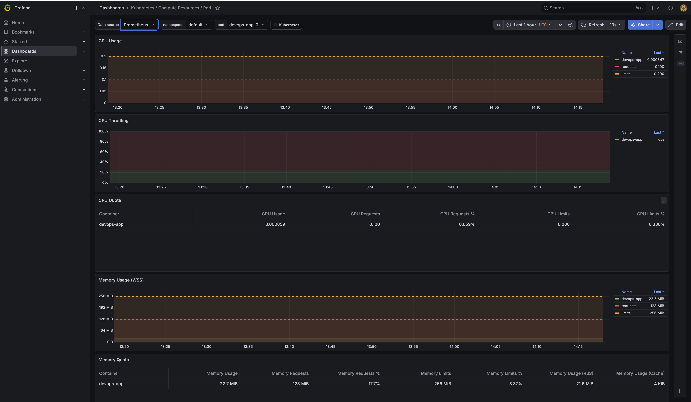
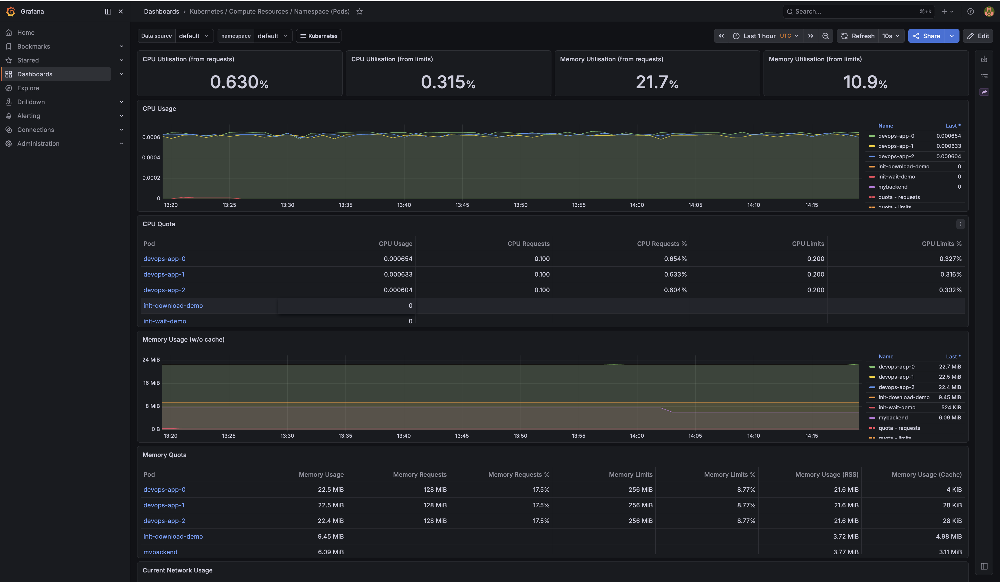
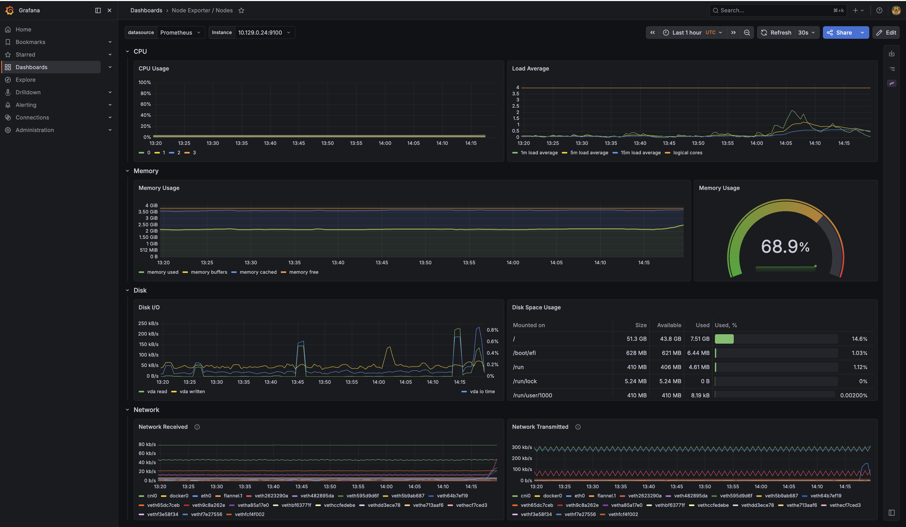
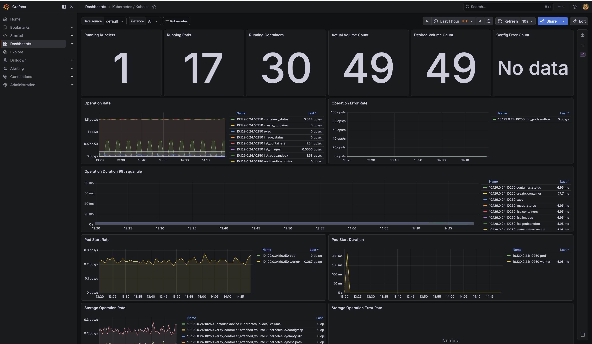
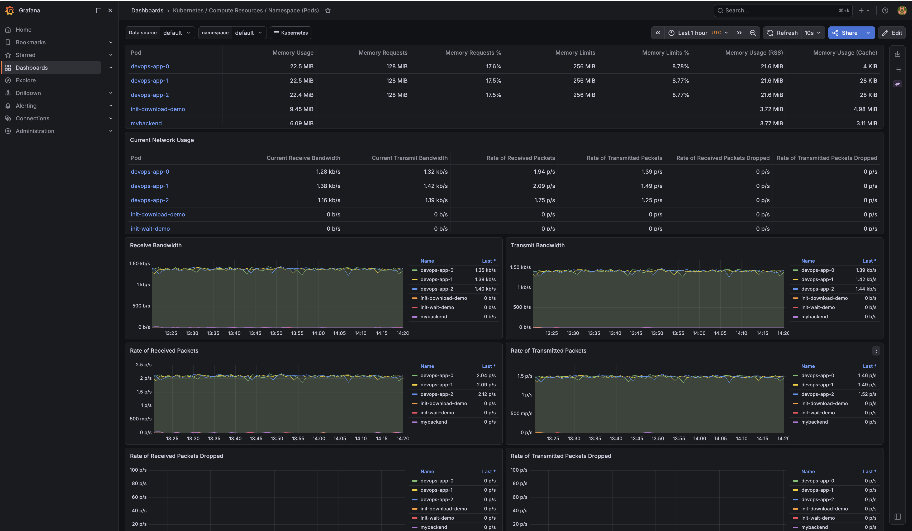
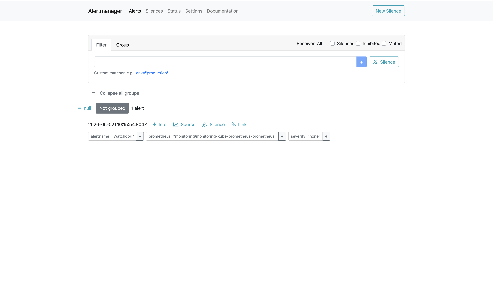

# Lab 16 - Kubernetes Monitoring & Init Containers

## 1. Stack Components

The Kube-Prometheus stack provides a complete monitoring solution for Kubernetes clusters. Below are the core components and their roles:

| Component | Description |
|-----------|-------------|
| **Prometheus Operator** | A Kubernetes operator that manages Prometheus instances declaratively via Custom Resource Definitions (CRDs). It automates the configuration, deployment, and lifecycle management of Prometheus, Alertmanager, and related monitoring components. |
| **Prometheus** | A time-series database and monitoring system that scrapes metrics from configured targets at regular intervals, stores them efficiently, and provides a powerful query language (PromQL) for analysis. It is the core data collection engine of the stack. |
| **Alertmanager** | Handles alerts generated by Prometheus rules. It deduplicates, groups, and routes alert notifications to the appropriate receivers (email, Slack, PagerDuty, etc.). It also supports silencing and inhibition of alerts. |
| **Grafana** | A visualization and dashboarding platform that queries Prometheus (and other data sources) to render interactive charts, graphs, and tables. The kube-prometheus-stack ships with pre-built dashboards for cluster monitoring. |
| **kube-state-metrics** | A service that listens to the Kubernetes API server and generates metrics about the state of Kubernetes objects - pods, deployments, nodes, services, etc. Unlike node-exporter, it focuses on cluster-level object metadata rather than hardware metrics. |
| **node-exporter** | A Prometheus exporter that runs as a DaemonSet on every node and exposes hardware and OS-level metrics such as CPU usage, memory consumption, disk I/O, and network statistics. |

### Installation

```bash
helm repo add prometheus-community https://prometheus-community.github.io/helm-charts
helm repo update

helm install monitoring prometheus-community/kube-prometheus-stack \
  --namespace monitoring \
  --create-namespace
```

## 2. Installation Evidence

Output of `kubectl get po,svc -n monitoring`:

```
NAME                                                         READY   STATUS    RESTARTS   AGE
pod/alertmanager-monitoring-kube-prometheus-alertmanager-0   2/2     Running   0          2m28s
pod/monitoring-grafana-6b664bbbc5-ftwkz                      3/3     Running   0          2m37s
pod/monitoring-kube-prometheus-operator-54f68d65b4-dp8fj     1/1     Running   0          2m37s
pod/monitoring-kube-state-metrics-5957bd45bc-hdrsp           1/1     Running   0          2m37s
pod/monitoring-prometheus-node-exporter-qpb2v                1/1     Running   0          2m37s
pod/prometheus-monitoring-kube-prometheus-prometheus-0       2/2     Running   0          2m27s

NAME                                              TYPE        CLUSTER-IP      EXTERNAL-IP   PORT(S)                      AGE
service/alertmanager-operated                     ClusterIP   None            <none>        9093/TCP,9094/TCP,9094/UDP   2m28s
service/monitoring-grafana                        ClusterIP   10.43.139.100   <none>        80/TCP                       2m37s
service/monitoring-kube-prometheus-alertmanager   ClusterIP   10.43.41.28     <none>        9093/TCP,8080/TCP            2m37s
service/monitoring-kube-prometheus-operator       ClusterIP   10.43.222.243   <none>        443/TCP                      2m37s
service/monitoring-kube-prometheus-prometheus     ClusterIP   10.43.53.94     <none>        9090/TCP,8080/TCP            2m37s
service/monitoring-kube-state-metrics             ClusterIP   10.43.77.82     <none>        8080/TCP                     2m37s
service/monitoring-prometheus-node-exporter       ClusterIP   10.43.181.86    <none>        9100/TCP                     2m37s
service/prometheus-operated                       ClusterIP   None            <none>        9090/TCP                     2m27s
```

All 6 pods are running successfully:
- **Alertmanager** (StatefulSet, 2/2 containers)
- **Grafana** (Deployment, 3/3 containers)
- **Prometheus Operator** (Deployment, 1/1)
- **kube-state-metrics** (Deployment, 1/1)
- **node-exporter** (DaemonSet, 1/1)
- **Prometheus** (StatefulSet, 2/2 containers)

## 3. Dashboard Answers

### Q1: Pod Resources - CPU/Memory usage of StatefulSet

**Dashboard:** "Kubernetes / Compute Resources / Pod"

The StatefulSet pod `devops-app-0` shows:
- **CPU Usage:** ~0.000647 cores (0.659% of 100m request, 0.330% of 200m limit)
- **CPU Throttling:** ~0% (well within limits)
- **Memory Usage (WSS):** 22.5 MiB (17.7% of 128 MiB request, 8.87% of 256 MiB limit)
- **Memory Usage (RSS):** 21.6 MiB
- **Memory Usage (Cache):** 4 KiB

The application is very lightweight, using minimal CPU and only ~22.5 MiB of memory.



### Q2: Namespace Analysis - Most/Least CPU in default namespace

**Dashboard:** "Kubernetes / Compute Resources / Namespace (Pods)"

CPU usage in the `default` namespace:
- **Overall CPU Utilisation:** 0.630% of requests, 0.315% of limits
- **Overall Memory Utilisation:** 21.7% of requests, 10.9% of limits

Per-pod CPU usage (from highest to lowest):
| Pod | CPU Usage | CPU Requests % |
|-----|-----------|----------------|
| devops-app-0 | 0.000654 | 0.654% |
| devops-app-1 | 0.000633 | 0.633% |
| devops-app-2 | 0.000604 | 0.604% |
| init-download-demo | 0 | - |
| init-wait-demo | 0 | - |

**Most CPU:** `devops-app-0` (0.000654 cores)
**Least CPU:** `init-download-demo` and `init-wait-demo` (0 cores - idle busybox containers)

Per-pod Memory usage:
| Pod | Memory Usage |
|-----|-------------|
| devops-app-0 | 22.7 MiB |
| devops-app-1 | 22.5 MiB |
| devops-app-2 | 22.4 MiB |
| init-download-demo | 9.45 MiB |
| mybackend | 6.09 MiB |



### Q3: Node Metrics - Memory usage (% and MB), CPU cores

**Dashboard:** "Node Exporter / Nodes"

Node metrics for `10.129.0.24`:
- **Memory Usage:** **68.9%** (~2.75 GiB used out of ~4 GiB total)
- **CPU Cores:** **4 logical cores** (visible in Load Average chart legend: 0, 1, 2, 3)
- **CPU Usage:** Low, mostly idle (under 5%)
- **Disk:** Root filesystem 51.3 GB total, 7.51 GB used (14.6%)
- **Load Average:** ~0.5 (1m), well below the 4-core capacity



### Q4: Kubelet - How many pods/containers managed?

**Dashboard:** "Kubernetes / Kubelet"

The kubelet on the single node manages:
- **Running Kubelets:** 1
- **Running Pods:** **17**
- **Running Containers:** **30**
- **Actual Volume Count:** 49
- **Desired Volume Count:** 49
- **Config Error Count:** No data (healthy)

The kubelet operation rate shows ~0.644 ops/s for container_status and ~1.54 ops/s for list_containers.



### Q5: Network - Traffic for pods in default namespace

**Dashboard:** "Kubernetes / Compute Resources / Namespace (Pods)" - Network section

Network traffic for pods in the `default` namespace:

| Pod | Receive Bandwidth | Transmit Bandwidth |
|-----|-------------------|-------------------|
| devops-app-0 | 1.28 kb/s | 1.32 kb/s |
| devops-app-1 | 1.38 kb/s | 1.42 kb/s |
| devops-app-2 | 1.16 kb/s | 1.19 kb/s |
| init-download-demo | 0 b/s | 0 b/s |
| init-wait-demo | 0 b/s | 0 b/s |

The StatefulSet pods have consistent low-level network traffic (~1.2-1.4 kb/s each direction), while the init container demo pods are idle. No dropped packets observed for any pod.



### Q6: Alerts - Active alerts count

**Alertmanager UI** (port 9093):

There is **1 active alert**:
- **Watchdog** - This is a health-check alert that is always firing. It serves as a dead man's switch to verify that the entire alerting pipeline (Prometheus -> Alertmanager -> notification channel) is functional. If this alert stops firing, it means something is broken in the monitoring stack.
  - `alertname="Watchdog"`
  - `prometheus="monitoring/monitoring-kube-prometheus-prometheus"`
  - `severity="none"`



## 4. Init Containers

### 4a. Download File Pattern

**File:** `k8s/init-download-pod.yaml`

This pattern uses an init container to download a file before the main application starts. The init container (`busybox`) downloads `https://example.com` into a shared `emptyDir` volume, which the main nginx container then serves.

**How it works:**
1. Init container `init-download` runs first, using `wget` to download a file to `/work-dir/index.html`
2. Both containers share the `workdir` volume (`emptyDir`)
3. Main container `main-app` (nginx) mounts the same volume at `/usr/share/nginx/html`
4. Once the init container completes successfully, the main container starts and serves the downloaded content

**Deployment and verification:**

```bash
$ kubectl apply -f k8s/init-download-pod.yaml
pod/init-download-demo created

$ kubectl get pod init-download-demo
NAME                 READY   STATUS    RESTARTS   AGE
init-download-demo   1/1     Running   0          25s
```

Init container logs:
```bash
$ kubectl logs init-download-demo -c init-download
Connecting to example.com (8.6.112.0:443)
wget: note: TLS certificate validation not implemented
saving to '/work-dir/index.html'
index.html           100% |********************************|   528  0:00:00 ETA
'/work-dir/index.html' saved
```

Verify the file is accessible in the main container:
```bash
$ kubectl exec init-download-demo -- cat /usr/share/nginx/html/index.html
<!doctype html><html lang="en"><head><title>Example Domain</title>...
```

The init container successfully downloaded the file and the main nginx container can serve it.

### 4b. Wait-for-Service Pattern

**Files:** `k8s/init-wait-pod.yaml` (pod) + `k8s/init-wait-service.yaml` (service)

This pattern uses an init container to block pod startup until a required dependency service is available. The init container repeatedly performs DNS lookups for `myservice` until it resolves.

**How it works:**
1. Init container `wait-for-service` runs an `nslookup` loop for `myservice.default.svc.cluster.local`
2. The loop sleeps 2 seconds between attempts
3. Once DNS resolves (meaning the service exists), the init container exits successfully
4. The main container then starts

**Deployment and verification:**

Step 1 - Deploy the pod (without the service):
```bash
$ kubectl apply -f k8s/init-wait-pod.yaml
pod/init-wait-demo created

$ kubectl get pod init-wait-demo
NAME             READY   STATUS     RESTARTS   AGE
init-wait-demo   0/1     Init:0/1   0          5s
```

The pod is stuck in `Init:0/1` because `myservice` doesn't exist yet.

Step 2 - Create the service and backend to unblock:
```bash
$ kubectl apply -f k8s/init-wait-service.yaml
service/myservice created

$ kubectl run mybackend --image=nginx --labels="app=mybackend" --port=80
pod/mybackend created

$ kubectl get pod init-wait-demo
NAME             READY   STATUS    RESTARTS   AGE
init-wait-demo   1/1     Running   0          27s
```

The pod transitions from `Init:0/1` to `Running` once the service is created.

Init container logs showing the wait -> success transition:
```bash
$ kubectl logs init-wait-demo -c wait-for-service
** server can't find myservice.default.svc.cluster.local: NXDOMAIN
** server can't find myservice.default.svc.cluster.local: NXDOMAIN
Waiting for myservice...

** server can't find myservice.default.svc.cluster.local: NXDOMAIN
** server can't find myservice.default.svc.cluster.local: NXDOMAIN
Waiting for myservice...

Name:	myservice.default.svc.cluster.local
Address: 10.43.79.56
```

The logs clearly show the init container failing with `NXDOMAIN` while the service didn't exist, then successfully resolving once `myservice` was created.
