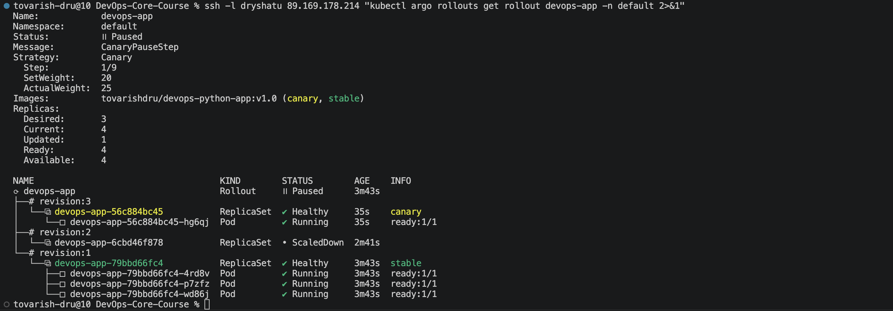
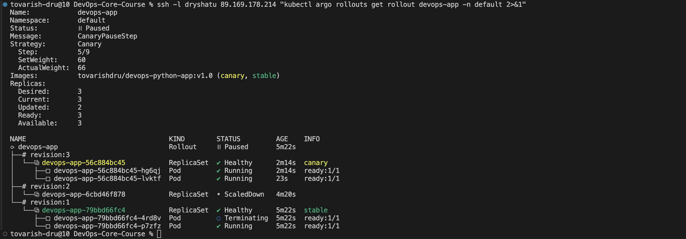
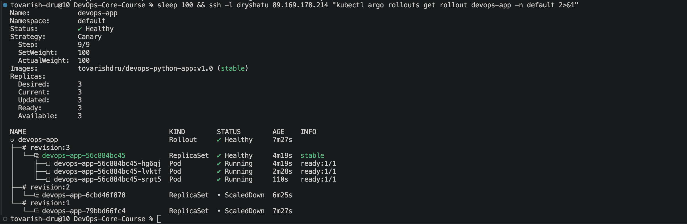
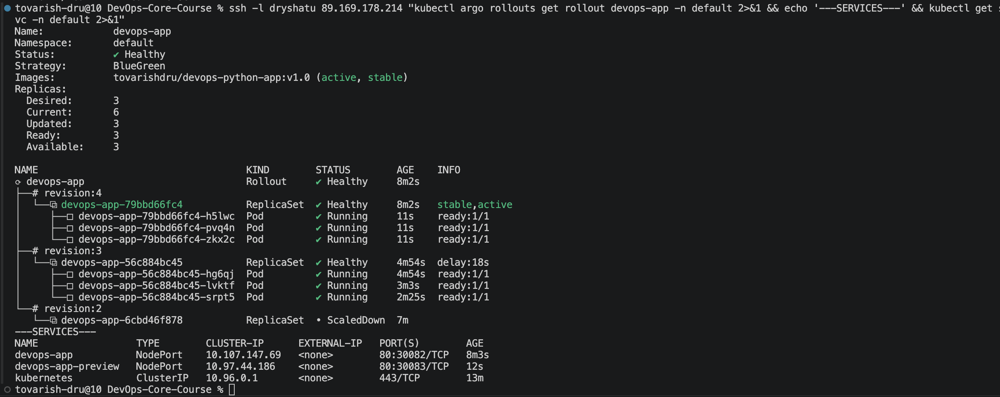
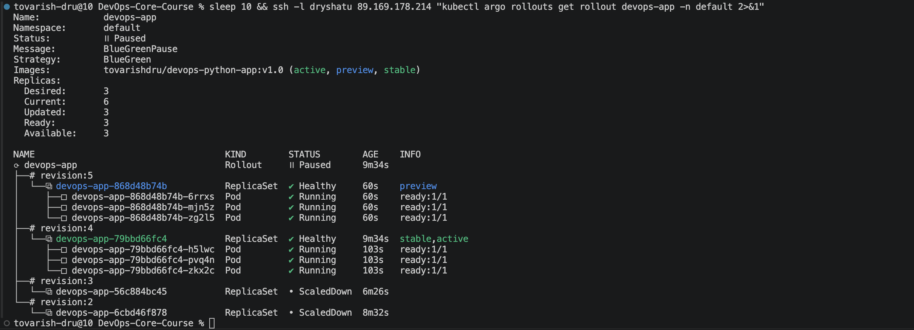
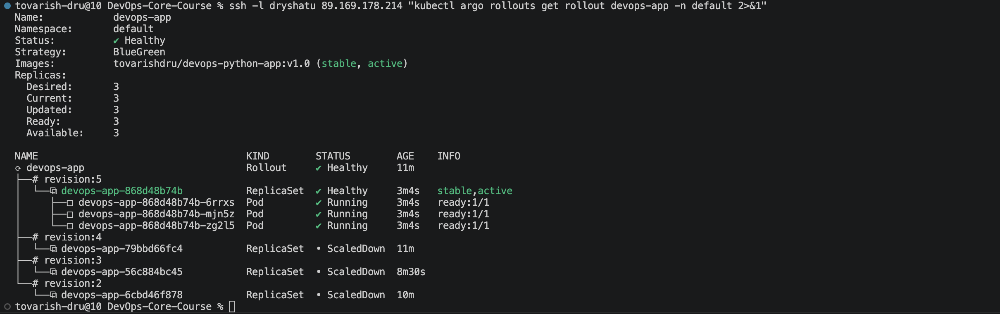
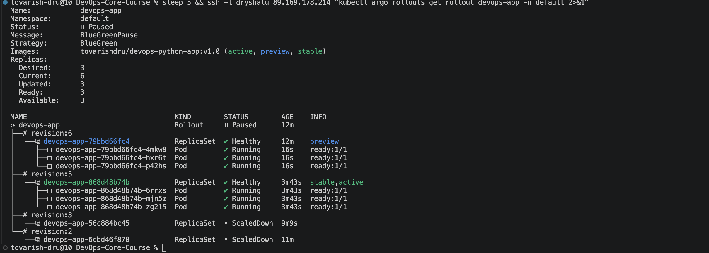
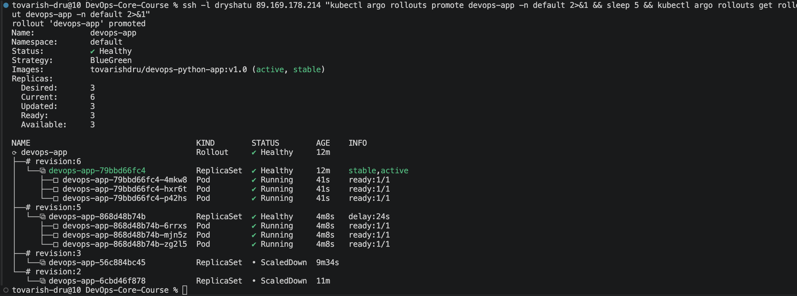

# Lab 14 — Progressive Delivery with Argo Rollouts

---

### Controller Installation

The Argo Rollouts controller was deployed into a dedicated `argo-rollouts` namespace:

```bash
kubectl create namespace argo-rollouts
kubectl apply -n argo-rollouts -f https://github.com/argoproj/argo-rollouts/releases/latest/download/install.yaml
```

This created the following resources:
- CRDs: `rollouts.argoproj.io`, `analysisruns.argoproj.io`, `analysistemplates.argoproj.io`, `experiments.argoproj.io`
- Controller deployment: `argo-rollouts`
- RBAC: ClusterRole, ClusterRoleBinding, ServiceAccount

### kubectl Plugin

The `kubectl-argo-rollouts` plugin (v1.9.0) was installed to provide CLI management of rollouts:

```
kubectl-argo-rollouts: v1.9.0+838d4e7
  BuildDate: 2026-03-20T21:08:11Z
  GoVersion: go1.24.13
  Platform: linux/amd64
```

### Dashboard

The Argo Rollouts Dashboard was deployed for visualization and is accessible via port-forward on port 3100:

```bash
kubectl apply -n argo-rollouts -f https://github.com/argoproj/argo-rollouts/releases/latest/download/dashboard-install.yaml
kubectl port-forward svc/argo-rollouts-dashboard -n argo-rollouts 3100:3100
```

Both the controller and dashboard pods were verified running in the `argo-rollouts` namespace.

---

## Rollout vs Deployment

The Argo Rollouts `Rollout` CRD is a drop-in replacement for the Kubernetes `Deployment` with additional progressive delivery capabilities.

### Key Differences

| Feature | Deployment | Rollout |
|---------|-----------|---------|
| **API Version** | `apps/v1` | `argoproj.io/v1alpha1` |
| **Kind** | `Deployment` | `Rollout` |
| **Strategy Options** | `RollingUpdate`, `Recreate` | `canary`, `blueGreen` |
| **Traffic Management** | No fine-grained control | Percentage-based traffic shifting |
| **Pause/Resume** | Not supported | Pause at any step, manual or timed |
| **Analysis** | Not supported | Metrics-based automated promotion/rollback |
| **Rollback** | Manual, slow | Instant, automated |
| **Preview Environment** | Not supported | Blue-green preview service |
| **Pod Template** | Standard | Identical to Deployment |

### Helm Chart Implementation

The chart uses a `rollout.enabled` flag in `values.yaml` to toggle between the two:
- When `rollout.enabled: true` → `rollout.yaml` is rendered, `deployment.yaml` is skipped
- When `rollout.enabled: false` → standard `deployment.yaml` is rendered, `rollout.yaml` is skipped

The `rollout.strategy` field selects between `canary` and `blueGreen` modes. A separate `values-bluegreen.yaml` override file switches the strategy without modifying the main values.

---

## Canary Deployment

### Strategy Configuration

The canary strategy was configured with progressive traffic shifting in 5 steps:

```yaml
rollout:
  enabled: true
  strategy: canary
  canary:
    steps:
      - setWeight: 20
      - pause: {}          # Manual promotion required
      - setWeight: 40
      - pause:
          duration: 30s    # Auto-promote after 30s
      - setWeight: 60
      - pause:
          duration: 30s
      - setWeight: 80
      - pause:
          duration: 30s
      - setWeight: 100
```

The first pause requires manual promotion via `kubectl argo rollouts promote`, giving operators time to verify the new version with a small percentage of traffic. Subsequent steps auto-promote after 30 seconds each.

### Rollout Progression

**Step 1 — Paused at 20% weight (manual promotion required):**

After deploying the initial version and triggering an update (changing `DEBUG=false` → `DEBUG=true`), the rollout paused at Step 1/9 with 20% weight. One canary pod was created alongside three stable pods.



The rollout shows:
- Status: ॥ Paused (CanaryPauseStep)
- Step 1/9, SetWeight: 20, ActualWeight: 25 (1 of 4 pods ≈ 25%)
- revision:3 (canary) — 1 pod running
- revision:1 (stable) — 3 pods running

**Step 2 — Progressing at 60% weight (auto-promotion):**

After manual promotion with `kubectl argo rollouts promote devops-app`, the rollout advanced through the 40% step and paused at 60%. The canary ReplicaSet scaled up while the stable scaled down.



The rollout shows:
- Status: ॥ Paused (CanaryPauseStep)
- Step 5/9, SetWeight: 60, ActualWeight: 66 (2 of 3 pods ≈ 66%)
- revision:3 (canary) — 2 pods running
- revision:1 (stable) — 1 pod running, 1 terminating

**Step 3 — Completed at 100%:**

After the remaining 30-second pauses auto-promoted through steps 7 and 9, the rollout completed successfully. All traffic shifted to the new version.



The rollout shows:
- Status: ✔ Healthy
- Step 9/9, SetWeight: 100, ActualWeight: 100
- revision:3 (stable) — 3 pods running
- revision:1 and revision:2 — ScaledDown

### Abort Demonstration

During the initial canary test, an abort was also demonstrated when an invalid image tag (`latest`) caused `ErrImagePull`. The `kubectl argo rollouts abort devops-app` command immediately shifted all traffic back to the stable version, and `kubectl argo rollouts retry rollout devops-app` was used to retry after fixing the issue.

---

## Blue-Green Deployment

### Strategy Configuration

The blue-green strategy was deployed using the `values-bluegreen.yaml` override:

```yaml
rollout:
  enabled: true
  strategy: blueGreen
  blueGreen:
    autoPromotionEnabled: false

service:
  previewNodePort: 30083
```

This creates two services:
- **Active service** (`devops-app`) on NodePort 30082 — serves production traffic
- **Preview service** (`devops-app-preview`) on NodePort 30083 — serves the new version for testing

### Initial Deployment with Services

After switching to blue-green strategy with `helm upgrade --install devops-app ./k8s/devops-app -f k8s/devops-app/values-bluegreen.yaml`, both services were created and the rollout was healthy.



The output shows:
- Strategy: BlueGreen, Status: ✔ Healthy
- revision:4 — stable, active (3 pods)
- Two services: `devops-app` (30082) and `devops-app-preview` (30083)
- 6 current pods (previous canary revision still scaling down with delay)

### Preview Environment

After triggering an update (adding `VERSION=v2` env var), the rollout created a new ReplicaSet as the preview while keeping the active version unchanged.



The rollout shows:
- Status: ॥ Paused (BlueGreenPause)
- revision:5 (preview) — 3 pods running the new version
- revision:4 (stable, active) — 3 pods running the old version
- 6 total pods (2x resources during blue-green deployment)

At this point, the preview service routes to the new version while the active service continues serving the old version. Both can be tested independently.

### Promotion

After verifying the preview, `kubectl argo rollouts promote devops-app` was executed. The switch was instant — the active service immediately pointed to the new ReplicaSet.



The rollout shows:
- Status: ✔ Healthy
- revision:5 — now stable, active (3 pods)
- revision:4 — ScaledDown
- Only 3 pods running (old version terminated)

### Rollback

To test rollback, `kubectl argo rollouts undo devops-app` was executed. This created a new revision (revision:6) as a preview with the previous version's configuration.



The rollout shows:
- Status: ॥ Paused (BlueGreenPause)
- revision:6 (preview) — 3 pods with the old version
- revision:5 (stable, active) — 3 pods with the current version
- 6 total pods again

After promoting the rollback with `kubectl argo rollouts promote devops-app`, the switch was instant:



The rollout shows:
- Status: ✔ Healthy
- revision:6 — now stable, active (old version restored)
- revision:5 — scaling down (delay:24s)

The rollback was instantaneous — no gradual traffic shifting, just an immediate service selector update.

---

## Strategy Comparison

### When to Use Each Strategy

| Scenario | Recommended Strategy | Reason |
|----------|---------------------|--------|
| Gradual rollout with traffic control | **Canary** | Fine-grained traffic percentage control |
| Need to test with real user traffic | **Canary** | Small percentage of users see new version |
| Zero-downtime instant switch | **Blue-Green** | All-or-nothing switch is instant |
| Need full preview environment | **Blue-Green** | Dedicated preview service for testing |
| Resource-constrained cluster | **Canary** | Shares resources, no 2x requirement |
| Critical production service | **Blue-Green** | Instant rollback, no mixed traffic |
| A/B testing scenarios | **Canary** | Percentage-based traffic splitting |
| Database migration with app update | **Blue-Green** | Clean separation between versions |

### Pros and Cons

#### Canary

| Pros | Cons |
|------|------|
| Gradual risk exposure | Slower full rollout |
| Fine-grained traffic control | Mixed versions serve traffic simultaneously |
| Lower resource overhead | More complex to debug issues |
| Supports automated analysis at each step | Requires good observability |
| Can catch issues with small user impact | Rollback scales down canary (not instant) |

#### Blue-Green

| Pros | Cons |
|------|------|
| Instant promotion and rollback | Requires 2x resources during deployment |
| Full preview environment for testing | All-or-nothing — no gradual exposure |
| Clean separation between versions | Higher resource cost |
| Simple mental model | No traffic percentage control |
| No mixed traffic — users see one version | Preview testing is manual |

### Conclusions:

- **Canary** — provides the best balance of safety and resource efficiency for most services, good default option
- **Blue-green** when instant rollback guarantees or a full preview environment for QA testing are required
- **For stateful applications:** neither — StatefulSets should be used instead
