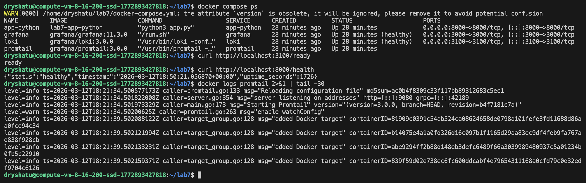
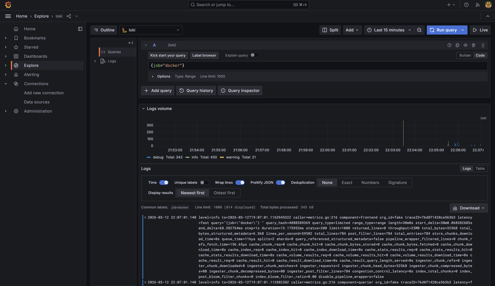
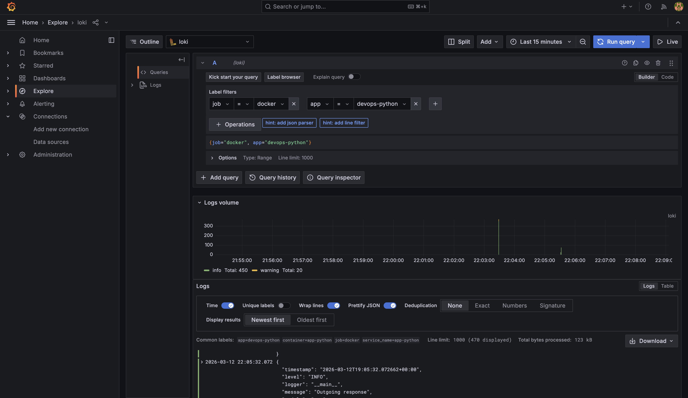
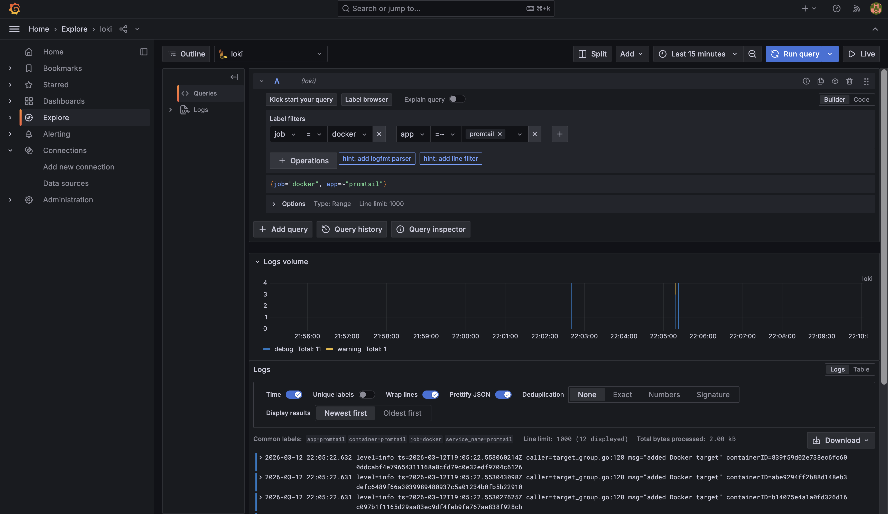
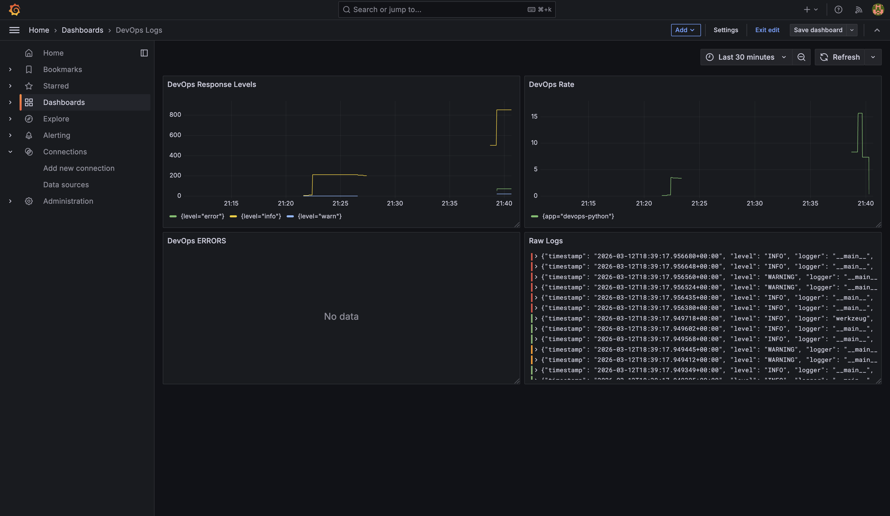

# Lab 7 — Observability & Logging with Loki Stack

## Architecture

```
┌─────────────────┐
│   Python App    │──┐
│   (Port 8000)   │  │
└─────────────────┘  │
                     │ JSON Logs
┌─────────────────┐  │
│     Grafana     │  │
│   (Port 3000)   │  │
└─────────────────┘  │
         │           │
         │ Query     │
         ▼           ▼
┌─────────────────┐  ┌──────────────┐
│      Loki       │◄─│   Promtail   │
│   (Port 3100)   │  │  (Port 9080) │
└─────────────────┘  └──────────────┘
         │                    │
         │                    │
    TSDB Storage      Docker Socket
```

### Components:
- **Loki 3.0**: Log aggregation with TSDB storage (10x faster queries)
- **Promtail 3.0**: Log collector with Docker service discovery
- **Grafana 11.3**: Visualization and dashboarding
- **Python App**: Flask application with JSON structured logging

## Setup Guide

### 1. Prerequisites
- Docker 29.3.0+
- Docker Compose 5.1.0+
- Ubuntu 24.04 LTS

### 2. Project Structure
```
lab7/
├── docker-compose.yml
├── loki/
│   └── config.yml
├── promtail/
│   └── config.yml
└── docs/
    └── LAB07.md
```

### 3. Deployment

```bash
cd ~/lab7
docker compose up -d
```

### 4. Verify Services



## Configuration

### Loki Configuration

**Key features:**
- **TSDB storage**: 10x faster queries compared to boltdb-shipper
- **7-day retention**: Automatic log cleanup after 168 hours
- **Filesystem storage**: Simple single-instance setup
- **Compactor**: Handles retention and cleanup

**Important settings:**
```yaml
schema_config:
  configs:
    - from: 2020-10-24
      store: tsdb          # TSDB for better performance
      object_store: filesystem
      schema: v13          # Latest schema version

limits_config:
  retention_period: 168h   # 7 days
  ingestion_rate_mb: 10
  per_stream_rate_limit: 5MB

compactor:
  retention_enabled: true
  delete_request_store: filesystem
```

### Promtail Configuration

**Features:**
- **Docker service discovery**: Automatically finds containers
- **Label filtering**: Only scrapes containers with `logging=promtail` label
- **Relabeling**: Extracts container name and app labels

**Key configuration:**
```yaml
scrape_configs:
  - job_name: docker
    docker_sd_configs:
      - host: unix:///var/run/docker.sock
        filters:
          - name: label
            values: ["logging=promtail"]
    relabel_configs:
      - source_labels: ["__meta_docker_container_name"]
        regex: "/(.*)"
        target_label: "container"
      - source_labels: ["__meta_docker_container_label_app"]
        target_label: "app"
```

## Application Logging

### JSON Logging Implementation

The Python application uses a custom `JSONFormatter` class to output structured logs:

```python
class JSONFormatter(logging.Formatter):
    def format(self, record):
        log_data = {
            "timestamp": datetime.now(timezone.utc).isoformat(),
            "level": record.levelname,
            "logger": record.name,
            "message": record.getMessage(),
            "module": record.module,
            "function": record.funcName,
            "line": record.lineno,
        }
        # Add extra fields if present
        if hasattr(record, "method"):
            log_data["method"] = record.method
        # ... more fields
        return json.dumps(log_data)
```

### Example Log Output

```json
{
  "timestamp": "2026-03-12T18:22:25.547807+00:00",
  "level": "INFO",
  "logger": "__main__",
  "message": "Incoming request",
  "module": "app",
  "function": "log_request",
  "line": 100,
  "method": "GET",
  "path": "/health",
  "client_ip": "172.18.0.1",
  "user_agent": "curl/8.5.0"
}
```

### Benefits of JSON Logging:
- Easy parsing by log aggregation tools
- Structured data for filtering and analysis
- Consistent format across services
- Extractable fields for LogQL queries


### Test LogQL Queries







## Dashboard Panels



### Panel 1: Logs Table
- **Type**: Logs
- **Query**: `{app=~"devops-.*"}`
- **Description**: Shows recent logs from all applications

### Panel 2: Request Rate
- **Type**: Time series
- **Query**: `sum by (app) (rate({app=~"devops-.*"} [1m]))`
- **Description**: Logs per second by application

### Panel 3: Error Logs
- **Type**: Logs
- **Query**: `{app=~"devops-.*"} | json | level="ERROR"`
- **Description**: Shows only ERROR level logs

### Panel 4: Log Level Distribution
- **Type**: Stat or Pie chart
- **Query**: `sum by (level) (count_over_time({app=~"devops-.*"} | json [5m]))`
- **Description**: Count of logs by level (INFO, ERROR, etc.)

## Production Configuration

### Resource Limits

All services have resource constraints:

```yaml
deploy:
  resources:
    limits:
      cpus: "1.0"
      memory: 1G
    reservations:
      cpus: "0.5"
      memory: 512M
```

### Health Checks

Loki and Grafana have health checks configured:

```yaml
healthcheck:
  test: ["CMD-SHELL", "wget --no-verbose --tries=1 --spider http://localhost:3100/ready || exit 1"]
  interval: 10s
  timeout: 5s
  retries: 5
  start_period: 10s
```

### Security

- **Grafana**: Anonymous access disabled, admin password set
- **Promtail**: Read-only access to Docker socket
- **Network isolation**: All services on dedicated `logging` network

## Testing

### Generate Test Logs

```bash
# Generate traffic to Python app
for i in {1..20}; do curl http://localhost:8000/; done
for i in {1..20}; do curl http://localhost:8000/health; done

# View logs
docker logs app-python | tail -20
```

### Verify Log Collection

The test result might be seen above on the exploration screenshots

## Challenges and Solutions

### Challenge 1: Loki Permission Errors
**Problem**: Loki couldn't create directories in `/tmp/loki`

**Solution**: Changed volume mount from `/tmp/loki` to `/loki` and updated config paths:
```yaml
volumes:
  - loki-data:/loki  # Instead of /tmp/loki
```

### Challenge 2: Retention Configuration
**Problem**: Loki failed with "delete-request-store should be configured"

**Solution**: Added `delete_request_store: filesystem` to compactor config:
```yaml
compactor:
  retention_enabled: true
  delete_request_store: filesystem
```

### Challenge 3: JSON Logging Format
**Problem**: Standard Python logging wasn't structured

**Solution**: Implemented custom `JSONFormatter` class with extra fields support

## Key Learnings

1. **TSDB vs BoltDB**: Loki 3.0's TSDB provides significantly better query performance
2. **Label Strategy**: Use labels for high-cardinality data (app, container) and parse JSON for low-cardinality fields
3. **Retention**: Always configure compactor when enabling retention
4. **Docker Labels**: Promtail filtering by labels prevents log collection from unwanted containers
5. **JSON Logging**: Structured logs are essential for effective log analysis
