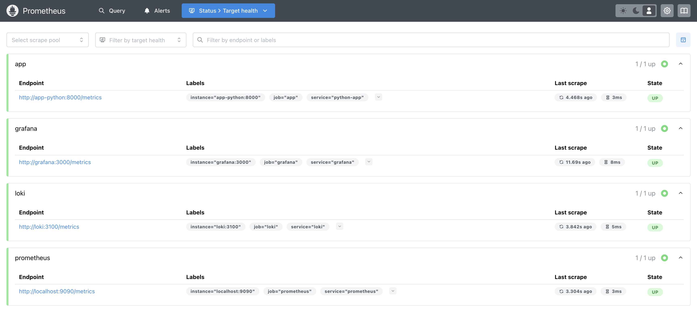
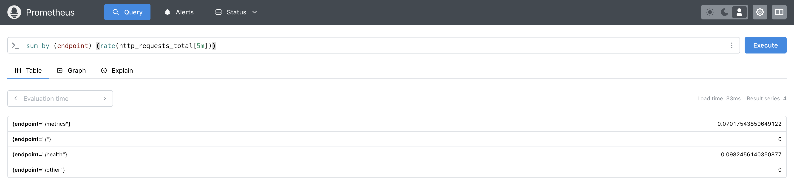
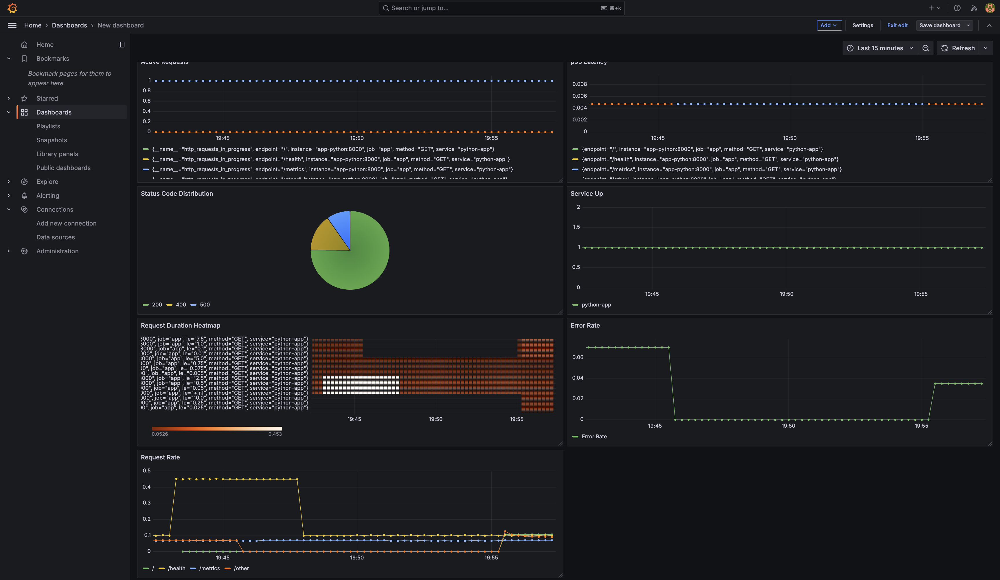
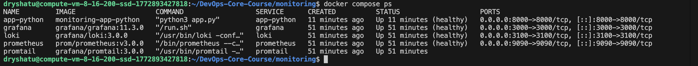

# Lab 8 — Metrics & Monitoring with Prometheus

## Architecture

```
┌─────────────────┐
│   Python App    │──┐
│   (Port 8000)   │  │ Metrics (/metrics)
└─────────────────┘  │
                     │
┌─────────────────┐  │
│   Prometheus    │◄─┘
│   (Port 9090)   │
└─────────────────┘
         │
         │ PromQL Queries
         ▼
┌─────────────────┐
│     Grafana     │
│   (Port 3000)   │
└─────────────────┘
         │
         │ LogQL Queries
         ▼
┌─────────────────┐  ┌──────────────┐
│      Loki       │◄─│   Promtail   │
│   (Port 3100)   │  │              │
└─────────────────┘  └──────────────┘
```

### Components:
- **Prometheus 3.0**: Time-series database for metrics collection
- **Grafana 11.3**: Unified visualization for metrics and logs
- **Loki 3.0**: Log aggregation system
- **Promtail 3.0**: Log collector
- **Python App**: Flask application with Prometheus instrumentation

## Application Instrumentation

### Metrics Implemented

#### 1. HTTP Request Counter
```python
http_requests_total = Counter(
    'http_requests_total',
    'Total HTTP requests',
    ['method', 'endpoint', 'status']
)
```
**Purpose**: Track total number of requests by method, endpoint, and status code.

#### 2. Request Duration Histogram
```python
http_request_duration_seconds = Histogram(
    'http_request_duration_seconds',
    'HTTP request duration in seconds',
    ['method', 'endpoint'],
    buckets=(0.005, 0.01, 0.025, 0.05, 0.075, 0.1, 0.25, 0.5, 0.75, 1.0, 2.5, 5.0, 7.5, 10.0)
)
```
**Purpose**: Measure request latency distribution for performance analysis.

#### 3. Active Requests Gauge
```python
http_requests_in_progress = Gauge(
    'http_requests_in_progress',
    'HTTP requests currently being processed',
    ['method', 'endpoint']
)
```
**Purpose**: Monitor concurrent request load.

#### 4. Application-Specific Metrics
```python
endpoint_calls = Counter(
    'devops_info_endpoint_calls',
    'Number of calls to specific endpoints',
    ['endpoint']
)

system_info_collection_duration = Histogram(
    'devops_info_system_collection_seconds',
    'Time spent collecting system information',
    buckets=(0.001, 0.005, 0.01, 0.025, 0.05, 0.1, 0.25, 0.5, 1.0)
)
```
**Purpose**: Track business-specific metrics and internal operation performance.

### Endpoint Normalization

To prevent metric cardinality explosion, endpoints are normalized:
- `/` → `/`
- `/health` → `/health`
- `/metrics` → `/metrics`
- All others → `/other`

### Test Endpoints

For comprehensive error monitoring, special test endpoints were added:

#### `/error` - Server Error (500)
Returns intentional 500 Internal Server Error for testing server error metrics.

#### `/bad-request` - Client Error (400)
Returns intentional 400 Bad Request for testing client error metrics.

## Prometheus Configuration

### Scrape Configuration

**File**: `monitoring/prometheus/prometheus.yml`

```yaml
global:
  scrape_interval: 15s
  evaluation_interval: 15s
  external_labels:
    monitor: 'devops-monitor'

scrape_configs:
  - job_name: 'prometheus'
    static_configs:
      - targets: ['localhost:9090']
        labels:
          service: 'prometheus'

  - job_name: 'app'
    static_configs:
      - targets: ['app-python:8000']
        labels:
          service: 'python-app'
    metrics_path: '/metrics'

  - job_name: 'loki'
    static_configs:
      - targets: ['loki:3100']
        labels:
          service: 'loki'
    metrics_path: '/metrics'

  - job_name: 'grafana'
    static_configs:
      - targets: ['grafana:3000']
        labels:
          service: 'grafana'
    metrics_path: '/metrics'
```

### Prometheus Targets Status





## PromQL Examples

#### 1. Request Rate (Requests per second)
```promql
# Total request rate
sum(rate(http_requests_total[5m]))

# Request rate by endpoint
sum by (endpoint) (rate(http_requests_total[5m]))

# Request rate by status code
sum by (status) (rate(http_requests_total[5m]))
```

#### 2. Error Rate
```promql
# 5xx server error rate
sum(rate(http_requests_total{status=~"5.."}[5m]))

# 4xx client error rate
sum(rate(http_requests_total{status=~"4.."}[5m]))

# Total error rate (4xx + 5xx)
sum(rate(http_requests_total{status=~"[45].."}[5m]))

# Error percentage
sum(rate(http_requests_total{status=~"[45].."}[5m])) / sum(rate(http_requests_total[5m])) * 100
```

#### 3. Duration (Latency)
```promql
# p50 latency
histogram_quantile(0.50, rate(http_request_duration_seconds_bucket[5m]))

# p95 latency
histogram_quantile(0.95, rate(http_request_duration_seconds_bucket[5m]))

# p99 latency
histogram_quantile(0.99, rate(http_request_duration_seconds_bucket[5m]))

# Average request duration
rate(http_request_duration_seconds_sum[5m]) / rate(http_request_duration_seconds_count[5m])
```

#### 4. Service Health
```promql
# Check if services are up
up{job="app"}

# Services down
up == 0
```

#### 5. Active Requests
```promql
# Current active requests
http_requests_in_progress

# Active requests by endpoint
sum by (endpoint) (http_requests_in_progress)
```

## Grafana Dashboard Configuration

### Data Sources

Two data sources configured in Grafana:
1. **Prometheus**: `http://prometheus:9090`
2. **Loki**: `http://loki:3100`

### Dashboard Panels

#### Panel 1: Request Rate (Time Series)
- **Query**: `sum by (endpoint) (rate(http_requests_total[5m]))`
- **Visualization**: Time series graph
- **Legend**: `{{endpoint}}`
- **Unit**: requests/sec

#### Panel 2: Error Rate (Time Series)
- **Query**: `sum(rate(http_requests_total{status=~"[45].."}[5m]))`
- **Visualization**: Time series graph
- **Color**: Red for errors
- **Unit**: errors/sec

#### Panel 3: Request Duration p95 (Time Series)
- **Query**: `histogram_quantile(0.95, rate(http_request_duration_seconds_bucket[5m]))`
- **Visualization**: Time series graph
- **Unit**: seconds
- **Thresholds**: Warning at 0.5s, Critical at 1s

#### Panel 4: Request Duration Heatmap
- **Query**: `rate(http_request_duration_seconds_bucket[5m])`
- **Visualization**: Heatmap
- **Shows**: Latency distribution over time

#### Panel 5: Active Requests (Gauge)
- **Query**: `sum(http_requests_in_progress)`
- **Visualization**: Gauge or Stat
- **Shows**: Current concurrent requests

#### Panel 6: Status Code Distribution (Pie Chart)
- **Query**: `sum by (status) (rate(http_requests_total[5m]))`
- **Visualization**: Pie chart
- **Shows**: 2xx vs 4xx vs 5xx distribution

#### Panel 7: Service Uptime (Stat)
- **Query**: `up{job="app"}`
- **Visualization**: Stat
- **Mapping**: 1 = UP (green), 0 = DOWN (red)



## Production Configuration

### Health Checks

All services have health checks configured:

**Prometheus**:
```yaml
healthcheck:
  test: ["CMD-SHELL", "wget --no-verbose --tries=1 --spider http://localhost:9090/-/healthy || exit 1"]
  interval: 10s
  timeout: 5s
  retries: 5
  start_period: 10s
```

**Application**:
```yaml
healthcheck:
  test: ["CMD-SHELL", "curl -f http://localhost:8000/health || exit 1"]
  interval: 10s
  timeout: 5s
  retries: 5
  start_period: 10s
```

### Resource Limits

**Prometheus**:
- CPU: 1.0 limit, 0.5 reservation
- Memory: 1G limit, 512M reservation

**Loki**:
- CPU: 1.0 limit, 0.5 reservation
- Memory: 1G limit, 512M reservation

**Grafana**:
- CPU: 0.5 limit, 0.25 reservation
- Memory: 512M limit, 256M reservation

**Application**:
- CPU: 0.5 limit, 0.25 reservation
- Memory: 256M limit, 128M reservation

### Data Retention

**Prometheus**:
```yaml
command:
  - '--storage.tsdb.retention.time=15d'
  - '--storage.tsdb.retention.size=10GB'
```

**Loki**:
```yaml
limits_config:
  retention_period: 168h  # 7 days
```

### Persistent Volumes

All data is persisted across container restarts:
- `prometheus-data`: Prometheus TSDB
- `loki-data`: Loki chunks and indexes
- `grafana-data`: Grafana dashboards and settings

## Testing Results

### Metrics Endpoint Output

```
# HELP http_requests_total Total HTTP requests
# TYPE http_requests_total counter
http_requests_total{endpoint="/",method="GET",status="200"} 30.0
http_requests_total{endpoint="/health",method="GET",status="200"} 2.0
http_requests_total{endpoint="/metrics",method="GET",status="200"} 2.0
http_requests_total{endpoint="/other",method="GET",status="400"} 30.0
http_requests_total{endpoint="/other",method="GET",status="500"} 10.0

# HELP http_request_duration_seconds HTTP request duration in seconds
# TYPE http_request_duration_seconds histogram
http_request_duration_seconds_bucket{endpoint="/",le="0.005",method="GET"} 28.0
http_request_duration_seconds_bucket{endpoint="/",le="0.01",method="GET"} 30.0
...

# HELP http_requests_in_progress HTTP requests currently being processed
# TYPE http_requests_in_progress gauge
http_requests_in_progress{endpoint="/",method="GET"} 0.0
```

### Container Health Status



## Metrics vs Logs: When to Use Each

### Use Metrics When:
- You need **aggregated data** (rates, percentiles, averages)
- You want **real-time alerting** on thresholds
- You need **long-term trend analysis**
- Storage efficiency is important (metrics are compact)
- You're monitoring **system resources** (CPU, memory, disk)

### Use Logs When:
- You need **detailed context** about specific events
- You're **debugging issues** or investigating incidents
- You need to see **exact request/response data**
- You want to **trace individual transactions**
- You need **audit trails** or compliance records

### Use Both Together:
- Metrics show **what** is happening (high error rate)
- Logs show **why** it's happening (specific error messages)
- Example workflow:
  1. Prometheus alert fires: "Error rate > 5%"
  2. Check Grafana metrics: Which endpoint?
  3. Query Loki logs: What are the actual errors?
  4. Fix the issue based on log details

## Challenges and Solutions

### Challenge 1: Health Check Failures
**Problem**: App container showing as unhealthy despite working correctly.

**Solution**: Added curl to the Docker image for health check execution:
```dockerfile
RUN apt-get update && apt-get install -y --no-install-recommends curl && rm -rf /var/lib/apt/lists/*
```

### Challenge 2: Metric Cardinality
**Problem**: Risk of high cardinality with dynamic endpoint paths.

**Solution**: Implemented endpoint normalization to group similar paths:
```python
def normalize_endpoint(path):
    if path == '/':
        return '/'
    elif path == '/health':
        return '/health'
    elif path == '/metrics':
        return '/metrics'
    else:
        return '/other'
```

### Challenge 3: Error Testing
**Problem**: No way to generate 4xx and 5xx errors for testing.

**Solution**: Added dedicated test endpoints:
- `/error` - Returns 500 Internal Server Error
- `/bad-request` - Returns 400 Bad Request

## Key Learnings

1. **RED Method**: Rate, Errors, Duration provide comprehensive service monitoring
2. **Cardinality Management**: Keep label values bounded to prevent metric explosion
3. **Histogram Buckets**: Choose buckets based on expected latency distribution
4. **Health Checks**: Essential for production deployments and orchestration
5. **Resource Limits**: Prevent resource exhaustion and ensure fair sharing
6. **Data Retention**: Balance storage costs with observability needs
7. **Unified Observability**: Combining metrics and logs provides complete visibility

## Best Practices Applied

1. ✅ **Instrumentation**: Added metrics at application boundaries (HTTP requests)
2. ✅ **Naming Convention**: Used Prometheus naming standards (_total, _seconds, etc.)
3. ✅ **Label Usage**: Meaningful labels without high cardinality
4. ✅ **Health Checks**: All services have proper health endpoints
5. ✅ **Resource Limits**: Configured for all containers
6. ✅ **Data Persistence**: Volumes for all stateful services
7. ✅ **Security**: Non-root user in application container
8. ✅ **Documentation**: Comprehensive guide with examples
